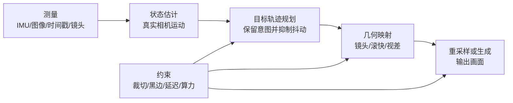
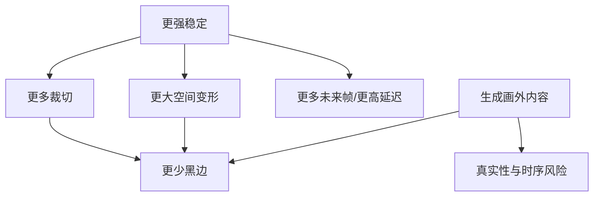
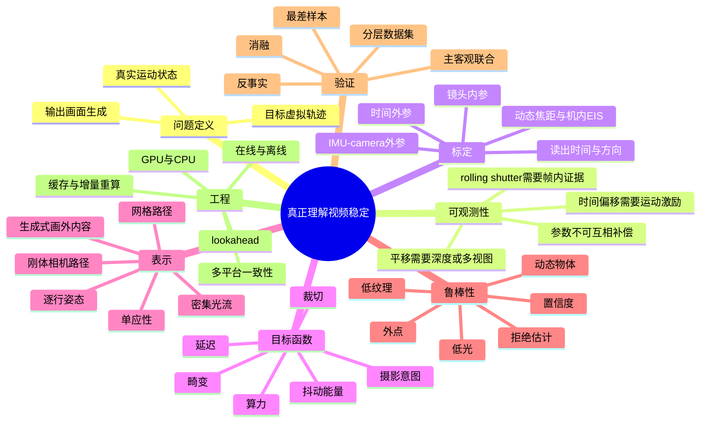
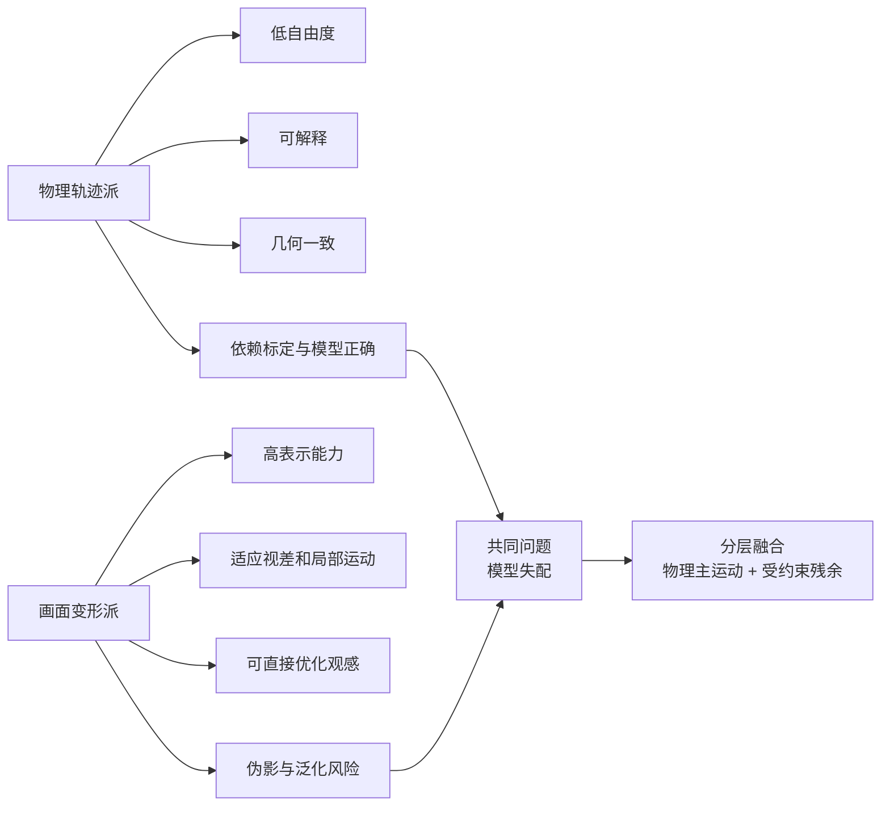
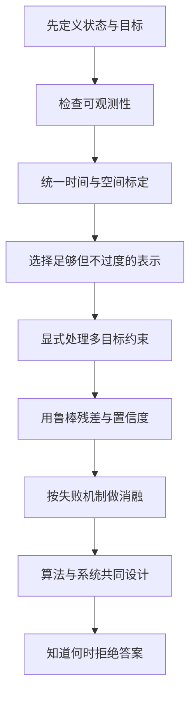

# 视频稳定领域：顶尖实践者的底层思路、核心分歧与理解鉴别测试

> 形成日期：2026-08-03
>
> 讨论对象：以 Gyroflow 所代表的陀螺仪辅助视频稳定为中心，同时覆盖视觉稳定、滚动快门、视觉惯性融合、轨迹优化、网格变形和学习式方法。
>
> 本文可独立阅读，重点讨论专家方法论、领域争议和理解鉴别题。

---

## 0. 结论先行

### 0.1 顶尖实践者最共通的底层思路

他们通常不会先问“哪个滤波器最好”，而会依次问：

1. **我要估计的状态到底是什么？** 是真实相机姿态、虚拟相机路径、二维全局变换，还是逐像素 warp field？
2. **这些状态在当前数据中是否可观测？** 没有运动时能不能估时间偏移？没有深度时能不能区分旋转和平移？
3. **测量模型是否正确？** 时间同步、IMU-camera 外参、镜头、rolling shutter、焦距和机内防抖是否进入同一坐标与时间模型？
4. **“抖动”与“摄影意图”如何区分？** 快速摇摄究竟是噪声还是导演想要的运动？
5. **约束是什么？** 黑边、裁切、畸变、延迟、算力和主观舒适度之间如何取舍？
6. **哪一个残差能证伪当前假设？** 如果效果差，如何区分是同步、姿态、镜头、滚快、平滑还是采样问题？
7. **结论能否跨数据分层成立？** 平均值是否掩盖低光、动态场景、强视差、长焦和高频振动 Badcase？

### 0.2 这个领域最深的分歧

最深的分歧不是 IMU 与视觉谁更高级，也不是传统方法与深度学习谁更现代，而是：

> **稳定器应优先寻找一条物理上合理的虚拟相机轨迹，还是应优先寻找一个让最终画面更稳定的空间变形场？**

- **物理轨迹派**强调统一相机模型、可解释姿态、几何一致性和低伪影。
- **画面变形派**强调视差、局部运动、rolling shutter 和复杂场景无法被单一刚体相机路径充分表达。
- **融合派**认为二者应分层：先用物理模型消除主运动，再用受约束的视觉变形修正模型残差。

### 0.3 如何区分真正吃透与死记

真正理解的人能做到：

- 在条件变化后重新推导结论，而不是复述“VQF 好”“rs-sync 准”“网格能处理视差”。
- 指出某个量何时不可观测，知道算法无法凭空恢复信息。
- 给出能证伪自己判断的实验，而不是只给支持性例子。
- 能把效果问题映射到误差链，并设计最小消融定位根因。
- 能钢人化反方，说明对方在什么条件下确实更优。

---

## 1. 证据范围与代表性工作

本文不是对某几位研究者个人思想的心理揣测，而是从下列代表性一手工作中归纳共同方法论：

| 编号 | 代表工作 | 它最突出的问题意识 |
|---|---|---|
| R1 | Grundmann、Kwatra、Essa，Robust L1 Optimal Camera Paths，CVPR 2011 | 稳定不是简单低通，而是带摄影风格与约束的相机路径优化 |
| R2 | Liu、Yuan、Tan、Sun，Bundled Camera Paths，ACM TOG 2013 | 单一全局路径不能充分处理视差和 rolling shutter，应使用空间变化的路径束 |
| R3 | Karpenko、Jacobs、Baek、Levoy，Gyroscope Stabilization and Rolling Shutter Correction，2011 | 正确标定的 gyro 可以在低光、动态物体和大视差下提供视觉方法缺少的旋转真值 |
| R4 | Qin、Shen，Online Temporal Calibration for Monocular Visual-Inertial Systems，IROS 2018 | 时间偏移不是预处理常数，而可以作为状态在线估计；不同步会直接污染状态估计 |
| R5 | Yu、Ramamoorthi，Learning Video Stabilization Using Optical Flow，CVPR 2020 | 稳定可以直接在密集光流表示上学习，绕开显式特征轨迹和固定运动模型 |
| R6 | Xu 等，Out-of-boundary View Synthesis，ICCV 2021 | 裁切与稳定是传统方案的根本矛盾，生成画外内容可改变问题边界 |
| R7 | Zhao 等，Minimum Latency Deep Online Video Stabilization，ICCV 2023 | 在线系统的核心不只是质量，还包括 latency、lookahead 与重复计算 |
| R8 | Xing 等，Deep Online Fused Video Stabilization，IEEE Access 2019 | 光流在低纹理/低光失效，gyro 有偏置和同步误差，融合能利用互补优势 |
| R9 | Song 等，SensorFlow: Sensor and Image Fused Video Stabilization，WACV 2025 | 仅 sensor 方法主要处理旋转，视觉可补充更复杂运动；融合和消融证据支持互补性 |
| R10 | Gyroflow 当前代码 | 工业级多厂商遥测、同步、镜头、rolling shutter、裁切闭环和多后端工程证据 |

其中 R4 的预印本标识为 `arXiv:1808.00692`；其余论文标题和会议足以在官方论文库定位。本文末尾给出完整参考文献。

---

## 2. 顶尖实践者共通的底层思路

### 2.1 把问题拆成“估计—规划—渲染”，而不是一个滤波器

视频稳定至少包含三个不同问题：

1. **状态估计**：相机实际如何运动？
2. **目标轨迹规划**：希望输出相机如何运动？
3. **图像生成/渲染**：怎样从原视频生成目标轨迹看到的画面？

**共通点**：顶尖方案会明确每一层的状态、观测、损失和约束。把三层混在一个“smoothness”参数里，会导致无法解释和无法消融。

在 Gyroflow 中：

- `GyroSource` 与 `PoseEstimator` 负责状态估计。
- `Smoothing` 与 `HorizonLock` 负责目标轨迹。
- `FrameTransform`、镜头模型、rolling shutter 和 GPU/CPU kernel 负责渲染。

证据见 `src/core/gyro_source/mod.rs:44`、`src/core/synchronization/mod.rs:66`、`src/core/stabilization/frame_transform.rs:11`。

### 2.2 先问可观测性，再谈优化精度

所谓可观测性，是“现有观测是否包含足够信息区分不同状态”。

典型例子：

- 视频和 gyro 都完全静止时，时间偏移几乎不可辨识；任意 offset 都能得到相似残差。
- 只有旋转、没有已知尺度和深度时，视觉难以恢复真实平移尺度。
- 所有特征都在同一平面上时，单应模型可能解释数据，但不代表恢复了完整三维运动。
- 同时把时间偏移、rolling shutter、焦距和姿态都开放优化，参数间可能互相补偿，得到低残差但错误的物理解。

**高手的习惯**：先设计“激励”。要估时间偏移，需要足够角速度变化；要估 rolling shutter，需要帧内方向相关形变；要估镜头，需要覆盖画面边缘和多个姿态。

R4 把时间偏移纳入视觉惯性状态在线估计，核心价值不是“多一个参数”，而是承认同步误差与运动状态耦合，必须讨论其可观测条件。

### 2.3 把标定看成模型的一部分，而不是准备工作

在普通软件思维中，标定常被当作一次性配置；在顶尖几何系统中，标定是测量方程本身。

必须同时考虑：

- 空间外参：IMU 坐标到相机坐标。
- 时间外参：视频时钟到 IMU 时钟。
- 相机内参：焦距、主点、畸变。
- rolling shutter：读出时间、方向和帧内曝光时刻。
- 动态内参：变焦、对焦、数字镜头和机内 EIS。

R3 的强项不是“用了 gyro”，而是把 gyro 和逐行成像模型结合。Gyroflow 的 `FrameTransform::at_timestamp` 同样把每行/列姿态、镜头和机内稳定参数组合起来，见 `src/core/stabilization/frame_transform.rs:165`。

### 2.4 建立误差预算，而不是只看最终画面

输出误差可以粗略分解为：

\[
E_{out}\approx E_{time}+E_{orientation}+E_{lens}+E_{readout}+E_{target}+E_{sampling}
\]

实际不是简单线性相加，但这种分层有助于诊断：

| 误差 | 常见视觉症状 | 优先检查 |
|---|---|---|
| 时间偏移 | 整体补偿领先/滞后，抖动像“反向追赶” | offset、时钟漂移、帧时间戳 |
| IMU 方向/姿态 | 轴间串扰，水平运动变成 roll/pitch | orientation、外参、符号 |
| 镜头模型 | 中心稳定而边缘摆动/弯曲 | profile、焦距、主点、数字镜头 |
| rolling shutter | 行相关果冻、斜线、波浪 | readout time、方向、帧反转 |
| 目标轨迹 | 过度滞后、回摆、意图被抹掉 | 平滑目标和时间常数 |
| 采样 | 模糊、振铃、锯齿、GPU/CPU 边界差 | 插值器、精度、颜色/边界处理 |

**高手与一般使用者的差异**：一般使用者会继续调 smoothness；高手会先判断症状属于哪一层。

### 2.5 区分“噪声运动”和“摄影意图”

稳定不是把角速度变成零。

如果目标函数只惩罚运动幅度，最优解通常是固定镜头；但这会抹掉摇摄、跟拍、转弯、bank angle 和构图意图。

R1 使用 L1 路径优化，试图得到静止、匀速和匀加速等具有电影感的分段轨迹，而不是普通低通。Gyroflow 默认平滑器则用运动速度调节平滑时间常数：低速强平滑，高速保留更多运动，见 `src/core/smoothing/default_algo.rs:259`。

二者形式不同，底层思想相同：

> 目标不是最少运动，而是最少“非意图、高频、不舒适”的运动。

### 2.6 先确定表示能力，再讨论求解器

求解器再强，也无法弥补状态表示不够。

- 单一全局旋转不能表示相机平移引起的视差。
- 单应性不能同时正确解释多深度场景。
- 逐行旋转能解释 rolling shutter 旋转形变，但不能解释所有物体运动。
- 自由网格能拟合更多现象，但可能把真实物体拉伸成稳定假象。
- 生成模型可以填画外区域，但不能保证生成内容真实。

R2 的核心贡献是把单一相机路径扩展为空间变化的 bundled paths，以表达视差和局部运动；它不是简单“换一个更好的优化器”。

### 2.7 把稳定、裁切、畸变、延迟看作 Pareto 问题

不存在同时满足以下所有目标的免费方案：

- 完全静止。
- 完全保留原始视场。
- 完全无畸变。
- 不生成新内容。
- 零延迟。
- 低算力。

顶尖方案通常不会把多目标压成一个神秘总分，而会展示 Pareto 前沿：

Gyroflow 的最大 zoom 闭环正是在显式处理这个冲突：裁切超过约束时，反向降低局部平滑，而不是假装三个目标都能满足，见 `src/core/lib.rs:548`。

### 2.8 用鲁棒残差、置信度和拒绝机制，而不是永远给答案

现实数据包含错误匹配、动态物体、传感器 glitch、时间戳异常和错误镜头。

高手系统的特征是：

- 使用鲁棒损失或内点选择。
- 比较最优解与次优解，而非只看最小 cost。
- 检查搜索结果是否靠近边界。
- 在缺少运动或纹理时拒绝估计。
- 报告置信度和失败原因。

Gyroflow 的快速同步会跳过低运动片段，并拒绝靠近搜索范围边缘的 offset，见 `src/core/synchronization/find_offset/essential_matrix.rs:40`。

**真正成熟的系统不以“永不报错”为目标，而以“知道什么时候不该相信自己”为目标。**

### 2.9 先做可解释基线，再增加复杂度

顶尖研究常从简单、可诊断的模型开始：

1. 原视频。
2. 正确时间和镜头下的纯旋转补偿。
3. 简单固定时间常数平滑。
4. 自适应路径或网格。
5. 融合、学习或生成式补边。

每增加一层，都应证明它解决了前一层的哪种残差。

这与“堆更多模块总会更好”相反。复杂模型可能只是在训练集上用自由度掩盖上游标定错误。

### 2.10 用反事实和消融建立因果，而不是看 demo

一段漂亮 demo 只能证明“这个组合在这个样本上可用”，不能证明某机制有效。

顶尖实践者会问：

- 同一个输出，如果使用真值 offset，结果是否显著改善？
- 关闭 rolling shutter 后，只有行相关残差上升吗？
- 网格方法的收益是否集中在强视差，而在远景中只增加畸变？
- 学习模型是否真正学到稳定，还是只学会裁切更多？
- 生成画外区域是否在时序上稳定，还是单帧看起来合理？

### 2.11 按失败机制分层，而不是只报数据集平均值

优秀评测至少区分：

- 低纹理与高纹理。
- 动态前景与静态远景。
- 纯旋转与强平移/视差。
- 低光与正常曝光。
- 短 rolling shutter 与长 rolling shutter。
- 内置 gyro 与外置 gyro。
- 定焦与变焦。
- 在线与离线。

否则一个方法可能靠“容易样本数量更多”取得平均优势，却在目标用户最关心的运动相机素材上失败。

### 2.12 把算法和系统共同设计

实时稳定不仅是数学问题，还涉及：

- 解码与特征计算分辨率。
- lookahead 帧数和用户可接受延迟。
- GPU/CPU 纹理拷贝。
- 多种像素格式和硬件编码。
- 参数变化后的增量重算与取消。
- 移动端功耗和内存。

R7 直接把 minimum latency 作为问题中心；Gyroflow 则通过异步 `compute_id`、checksum、GPU 缓存和 CPU fallback 支撑交互预览，见 `src/core/lib.rs:636` 和 `src/core/stabilization/mod.rs:467`。

---

## 3. 专家思维知识地图

---

## 4. 最大分歧：物理相机轨迹，还是画面空间变形

### 4.1 物理轨迹派的最强版本

### 主张

先估计真实相机运动，再规划一条合理的虚拟相机轨迹，最后通过明确的相机模型渲染。空间变形应尽量来自可解释的镜头、rolling shutter 或刚体投影，而不是自由拉伸。

### 最拿得出手的证据

1. **R1：L1 Camera Paths**
   - 简单平滑容易产生不自然的低频漂移。
   - 对相机路径的一阶、二阶和三阶导数使用 L1 目标，可以产生静止、匀速、匀加速的分段电影感运动。
   - 证据说明“目标路径的结构”比“选择哪个低通滤波器”更重要。

2. **R3：Gyroscope + Rolling Shutter**
   - gyro 不依赖图像纹理，因此在低光、模糊、大面积动态物体和视差场景中有天然优势。
   - 高频角速度可插值到每一行的曝光时间，直接修正 rolling shutter。
   - 这是纯视觉方法最难稳定工作的场景之一。

3. **R4：在线时间标定**
   - 视觉惯性系统若忽略时间偏移，状态估计会被系统性污染。
   - 把 offset 作为状态估计，比假设硬件永远同步更符合真实系统。

4. **R10：Gyroflow 工程证据**
   - 多厂商 gyro、镜头、动态焦距、IBIS/OIS/EIS、逐行姿态和多后端渲染在实际产品中形成闭环。
   - 中央旋转模型可被缓存、解释、导出和跨平台复现。

### 对反方最强的批评

- 自由网格或学习 warp 可能把前景物体拉伸，获得低运动分数却破坏几何真实性。
- 密集视觉方法在低光、模糊、弱纹理和大动态物体中没有可靠观测。
- 高自由度模型可能把错误同步或镜头参数“吸收”为变形，得到看似稳定但不可解释的结果。
- 生成画外内容改变了事实性，不适合要求严格真实性的运动记录、测量或后期工作流。

### 自身最难回避的问题

- 单一刚体旋转不能消除相机平移和多深度视差。
- 即使真实姿态完全准确，近景步行素材仍会有明显残余运动。
- 物理轨迹正确不等于画面主观最好；构图和视觉显著性未必被角速度目标覆盖。

### 4.2 画面变形派的最强版本

### 主张

用户最终观看的是图像，不是相机状态。应直接优化特征轨迹、密集光流、网格或输出帧，让画面内容稳定，即使变换不对应唯一刚体相机。

### 最拿得出手的证据

1. **R2：Bundled Camera Paths**
   - 单一全局路径在视差和 rolling shutter 下会产生 wobble。
   - 空间变化的路径束可以让不同区域拥有不同运动补偿，同时通过正则保持空间一致。
   - 这直接证明“一个物理相机路径”在某些素材上表示能力不足。

2. **R5：Optical Flow Learning**
   - 用每像素 motion representation 代替稀疏特征和固定低维运动模型。
   - 论文报告在其评测上提升稳定性、裁切和畸变指标，并减少传统长轨迹构建成本。
   - 说明数据驱动方法能够学习复杂局部运动的统计先验。

3. **R6：Out-of-boundary Synthesis**
   - 传统防抖的裁切限制来自“输出只能采样原帧”。
   - 一旦允许时空生成画外内容，稳定和视场的 Pareto 边界可以外移。

4. **R7：Minimum Latency Online Stabilization**
   - 通过重新组织在线平滑问题和避免重复优化，可以同时改善延迟与效率。
   - 说明纯离线全局轨迹并非唯一高质量路径。

### 对反方最强的批评

- “物理正确”常建立在纯旋转、正确标定和静态场景假设上，而用户素材经常违反这些假设。
- gyro 只能直接测角速度，不能测相机平移；accel 双积分漂移严重。
- 机内裁切、数字稳定、变焦和后处理可能让裸传感器运动与最终图像不一致。
- 只优化姿态曲线容易忽略主体构图、局部显著物体和视觉舒适度。

### 自身最难回避的问题

- 高自由度 warp 容易产生局部拉伸、透视不一致和“橡皮画面”。
- 学习方法可能把训练数据偏见当作稳定先验，跨设备和极端运动泛化难证明。
- 密集视觉仍依赖图像质量；看不见或看错时，模型可能自信地产生错误结果。
- 生成式补边的单帧合理性不等于跨帧真实和一致。

### 4.3 融合派的证据与局限

R8 和 R9 都把问题描述为互补传感器融合：

- 图像可观察平移、视差和最终画面运动，但会受低纹理、模糊和动态物体影响。
- gyro 高频、低延迟、对纹理不敏感，但主要提供旋转，且有偏置、同步和外参误差。

**融合派最强主张**：

> 先用 sensor/物理模型建立稳定、可解释的主运动，再用视觉估计模型残差；视觉不必从零恢复全部运动，sensor 也不必承担其不可观测的平移。

SensorFlow 的消融实验报告 sensor 与 image 两类输入都对结果有贡献，是融合路线的直接证据。

**融合派的最大风险**：

- 模块更多不代表信息更多；如果没有可观测性分析，两个错误系统可能互相补偿。
- 端到端融合可能失去“哪个传感器错了”的可诊断性。
- 训练集中的时间偏移、镜头和设备分布可能成为隐含先验。

### 4.4 本质上双方争的是什么

真正的争议变量是：

1. 允许多少自由度。
2. 物理真实性和视觉稳定哪个优先。
3. 模型误差由校准修复，还是由空间 warp 吸收。
4. 系统失败时是否必须可解释。
5. 输出是否允许生成原视频中不存在的内容。

---

## 5. 其他重要分歧

### 5.1 离线全局优化 vs 在线因果稳定

| 离线派 | 在线派 |
|---|---|
| 可使用未来帧，易做零相位平滑和全局路径 | 必须因果或有限 lookahead，强调低延迟 |
| 更适合电影后期和高质量输出 | 更适合相机预览、直播、会议和移动端 |
| 可统一处理长时间摄影意图 | 必须处理状态漂移和快速响应 |
| 代价是等待、内存和交互重算 | 代价是质量上限和 latency-quality 权衡 |

**双方最强证据**：

- R1、R2 展示全局或长轨迹优化对电影感和平滑性的优势。
- R7 展示重新设计在线问题后，低延迟并不必然意味着低质量。

**判断标准**：不是抽象地选一边，而是先确定最大允许 lookahead。Gyroflow 当前主要是离线/交互式非因果系统，因此双向平滑合理；若迁移到直播，必须重写目标，而不是简单把未来样本删掉。

### 5.2 裁切 vs 空间变形 vs 生成式补边

- 裁切派：真实性强、失败模式清楚，但损失视场。
- warp 派：保留更多画面，但可能局部拉伸。
- 生成派：可以全帧输出，但引入内容真实性和时序一致性风险。

R6 证明生成式方法能改变传统裁切上限，但不能自动证明其适合所有专业场景。

### 5.3 显式几何 vs 端到端学习

显式几何最强在：

- 可解释和可校准。
- 能用物理不变量做测试。
- 跨设备时只需更新参数，不一定重新训练。

学习方法最强在：

- 能表示复杂残差和内容先验。
- 可把检测、匹配、平滑和 warp 联合优化。
- 可能减少人工启发式。

内行真正争论的不是“要不要神经网络”，而是：

- 网络应估计物理状态、估计置信度、估计残余，还是直接生成输出？
- 哪些变量必须受几何约束？
- 网络失败时能否被传统残差检测出来？

### 5.4 统一客观指标 vs 场景化主观质量

稳定性、裁切率和畸变分数容易计算，但都能被“投机”：

- 无限裁切可以提高稳定分。
- 自由 warp 可以降低轨迹运动但增加局部畸变。
- 模糊输出可能让光流看起来更稳定。
- 主体固定但背景扭曲，某些全局指标仍可能很好。

因此顶尖评测通常需要：

1. 多目标指标。
2. Badcase 分层。
3. 盲测或用户偏好。
4. 对摄影意图和真实性的任务特定约束。

---

## 6. 对 Gyroflow 的具体判断

### 6.1 当前站位

Gyroflow 明显更接近“物理轨迹 + sensor-first + 离线高质量”路线：

- 默认 VQF 或相机姿态。
- 视觉主要用于同步和方向/姿态辅助。
- 显式镜头与 rolling shutter 模型。
- 姿态域平滑。
- 安全 FOV 与最大 zoom 闭环。
- 高质量确定性重采样。

### 6.2 这一路线最应该补什么

不是立即改成端到端网络，而是补上它自身模型无法解释的残差：

1. 在 IMU 主旋转后测量残余视觉运动。
2. 把残余按深度/动态区域/rolling shutter 症状分类。
3. 只对确认是相机平移或模型残差的部分使用受约束网格。
4. 把动态物体排除在相机残余估计之外。
5. 所有残余修正都设幅度、空间光滑和时间光滑上限。

### 6.3 能判定路线是否值得的实验

| 假设 | 对照 | 证伪条件 |
|---|---|---|
| 残余网格主要改善强视差 | 远景/近景分层，刚体 vs 残余网格 | 远景也同样大幅改善，说明刚体上游可能有误差 |
| sensor-first 在低光更稳 | 同步真值下 sensor vs vision | 视觉在低光仍稳定优于 sensor，需要检查 sensor 标定或评价定义 |
| 生成补边减少裁切且不伤真实性 | crop vs synthesis 盲测 | 时序闪烁、内容错误或专业用户拒绝率高 |
| Default 第二遍保留意图 | 单遍 vs 双遍，按快速摇摄分层 | 稳定提升小但裁切/滞后明显变差 |
| rs-sync 值得额外成本 | Essential/Visual/rs-sync 与真值 offset | MAE 无显著改善或只在少数标签有效 |

---

## 7. 如何设计“理解鉴别测试”

### 7.1 不要考什么

以下题型主要考记忆，不足以证明理解：

- 四元数定义是什么？
- Gyroflow 支持哪些积分方法？
- rolling shutter 是什么？
- AKAZE、PyrLK、DIS 谁更快？
- 默认平滑器参数是多少？

这些可作为入门门槛，但不能区分会背文档与能解决新问题的人。

### 7.2 应该考什么

高鉴别度题目应包含至少两项：

- 条件不完整，需要先指出不可观测或需要补充信息。
- 多个合理方案，需要给出适用边界而非唯一答案。
- 提供互相冲突的症状，要求建立误差链。
- 要求设计最小实验来证伪自己的判断。
- 改变一个前提后，原答案必须改变。
- 要求量化取舍，而非用“更稳、更准”形容。
- 要求钢人化反方。

### 7.3 通用评分尺

每题建议按 0–4 分评分：

| 分数 | 表现 |
|---:|---|
| 0 | 术语错误，或给出与条件矛盾的结论 |
| 1 | 记得相关术语/经验结论，但没有机制和边界 |
| 2 | 能解释单层机制，能给出基本正确方案 |
| 3 | 能跨同步、几何、平滑、裁切或系统层推理，并提出可执行验证 |
| 4 | 能指出不可观测性/反例，钢人化备选方案，给出可证伪指标和决策阈值 |

**死记型回答特征**：总说“使用更先进算法”“调高平滑”“用深度学习”“多加传感器”，不说明信息从哪里来、失败如何识别。

**真正理解型回答特征**：先列假设，指出缺失信息，给出症状—机制—实验闭环，并说明何时自己的方案会输。

---

## 8. 理解鉴别测试题与评分要点

### 8.1 第一组：可观测性与第一性原理

### 题 1：静止片段能否自动同步

**题目**：视频持续 8 秒，画面和相机几乎完全静止；gyro 数据完整。请估计视频与 gyro 的时间偏移，要求精度优于 1 ms。你会怎么做？

**真正理解的回答要点**：

- 首先指出在缺少角速度变化时 offset 基本不可观测，不能承诺 1 ms。
- 解释任意时间平移都产生近似相同运动残差。
- 建议寻找其他有运动片段、使用硬件时间戳或人为制造旋转激励。
- 给出置信度拒绝，而不是强行返回 offset。

**死记陷阱**：回答“使用 rs-sync，因为它最准”。

### 题 2：只凭 gyro 能否消除步行视差

**题目**：相机向前步行，近处栏杆和远处建筑出现明显相对运动；gyro 完全准确。为什么稳定后仍可能晃？

**回答要点**：

- gyro 直接测角速度，不提供可用的相机平移轨迹和场景深度。
- 纯旋转补偿对不同深度的平移视差无法同时成立。
- 可选方案是视觉残余、深度/3D 模型或受约束网格。
- 说明网格会带来局部畸变风险。

**死记陷阱**：归因于“gyro 精度不够”。

### 题 3：低标定 RMS 是否足够

**题目**：某镜头 profile 的棋盘格 RMS 很低，但真实广角视频边缘仍明显摆动。列出至少四种可能原因，并给出区分实验。

**回答要点**：

- 标定图没有充分覆盖边缘或姿态分布。
- 使用了不同分辨率、裁切模式、数字镜头、对焦或焦距。
- 主点/非对称畸变、动态镜头或机内 EIS 未建模。
- rolling shutter 或同步误差在边缘被放大。
- 实验应包含中心/边缘分区残差、关闭滚快、真值同步、不同 profile 对照。

**死记陷阱**：只说“重新标定，多拍几张棋盘格”。

### 题 4：时间偏移与 rolling shutter 能否互相补偿

**题目**：优化器同时开放全局时间偏移和 rolling shutter readout time。它得到很低残差，是否能证明两个参数都正确？

**回答要点**：

- 不能；二者都改变帧内/帧间姿态采样时刻，可能相关或局部互相补偿。
- 需要不同运动方向、不同图像行位置和多片段激励。
- 使用硬件/独立真值、参数剖面或 Hessian/置信区间检查可辨识性。
- 分阶段标定或加入合理先验。

**死记陷阱**：认为“损失最低就是正确”。

### 8.2 第二组：症状诊断

### 题 5：中心稳定、边缘摆动

**题目**：稳定后画面中心几乎不动，但四角随着相机转动周期性摆动。按优先级给出诊断树。

**回答要点**：

1. 镜头 profile、焦距/裁切模式和数字镜头是否正确。
2. rolling shutter 时间/方向是否错误，观察残差是否按行变化。
3. 全局同步误差通常会同时影响中心，不应第一优先。
4. 检查 GPU/CPU 映射一致性和边界采样。
5. 用无畸变合成数据和真值姿态隔离几何模块。

**死记陷阱**：直接加大 smoothness。

### 题 6：出现“反向追赶”

**题目**：每次快速转动后，稳定画面会先向错误方向移动，再追赶回来。最可能的三类原因是什么？如何区分？

**回答要点**：

- 时间 offset/漂移：补偿相位错误，真值 offset 对照可验证。
- 因果滤波或过长时间常数：目标轨迹滞后；改为双向/减少时间常数对照。
- 错误坐标轴/符号：某些方向响应反向；做单轴旋转测试。
- 说明三者视觉症状可能相似，必须做受控激励。

### 题 7：果冻修正后更严重

**题目**：开启 rolling shutter correction 后，垂直线波浪更严重。不要只给一个原因，设计最小排查顺序。

**回答要点**：

- 先验证 readout time 的符号、方向和单位。
- 验证 framebuffer inversion、视频旋转与横/纵读出组合。
- 检查 offset，因为逐行姿态建立在正确帧中心时间上。
- 用 global-shutter/合成逐行数据验证 kernel。
- 从 0 逐渐扫描 readout，观察残差是否有单峰最优，而不是盲调。

### 题 8：稳定指标很好但人看着晕

**题目**：算法的背景轨迹 RMS 最低，但用户盲测偏好更差。可能发生了什么？

**回答要点**：

- 过度裁切或 zoom breathing。
- 低频摄影意图被抹掉，转向滞后和回摆。
- 局部 warp 扭曲人物或前景。
- 输出模糊降低了光流运动分数。
- 地平线过度锁定，违背 bank/转弯感受。
- 指标必须加入裁切、畸变、jerk、意图保真和主观评价。

### 8.3 第三组：方案选型

### 题 9：三个产品场景怎么选

**题目**：分别为以下场景选主方案，并说明为什么另外两类方案不优：

1. FPV 无人机，强振动、低光，有 Blackbox gyro，允许离线。
2. 手机视频会议，低延迟，无可用 gyro API，人物占画面大部分。
3. 电影后期，近景推轨、强视差，允许长时间离线处理。

**参考方向**：

- FPV：sensor-first + rolling shutter + 强滤波/故障诊断，视觉用于同步和残余验证。
- 会议：在线视觉，人脸/主体保护，有限 lookahead，低自由度 warp。
- 电影：全局 3D/长轨迹 + 分层/网格或场景重建，人工约束和主观审片。

**高分要求**：必须讨论可观测性、延迟、动态物体、真实性和算力，而不是只报算法名。

### 题 10：是否应引入端到端模型

**题目**：团队提出用一个网络从视频+gyro直接输出稳定帧，替代同步、姿态、镜头和裁切模块。你如何评审？

**回答要点**：

- 先要求明确训练目标、设备/镜头/offset 分布和失败检测。
- 端到端可能学习隐式同步和镜头，但可诊断性、跨设备泛化、真实性存在风险。
- 提议分层对照：网络估置信度/残余 vs 网络估姿态 vs 直接生成帧。
- 设计 out-of-distribution、错误 profile、错误 offset、低光和动态物体测试。
- 要求与显式几何基线做消融，不接受只比较最终 demo。

### 题 11：刚体还是网格

**题目**：加入网格稳定后，强视差素材更稳，但人脸偶尔拉长。你会如何限制网格，而不是简单关闭？

**回答要点**：

- 先用 gyro/全局模型去主运动，网格只拟合残余。
- 动态/人脸/语义主体区域提高刚性权重或 mask。
- 限制 Jacobian、局部尺度、剪切和时间变化。
- 使用多深度/静态背景内点估计。
- 当残余不足或置信度低时回退刚体。

### 题 12：裁切还是生成

**题目**：运动纪录片要求尽量保留视场，是否应默认生成画外内容？

**回答要点**：

- 先确认真实性要求；纪录片和测量类工作流可能不能接受虚构内容。
- 生成可作为可标记选项，不应隐式替代裁切。
- 评测需包含跨帧一致、重复纹理、快速运动、边界主体和错误内容率。
- 可采用 crop、背景填充、时域复用、生成的分级策略。

### 8.4 第四组：实验与因果

### 题 13：证明默认平滑第二遍有效

**题目**：Default smoother 有基于姿态距离的第二遍平滑。设计实验判断它是否真正改善“低速去抖、高速保意图”，而不是只增加裁切。

**回答要点**：

- 单遍/双遍唯一变量对照。
- 按低速手抖、匀速摇摄、快速转向、长焦/广角分层。
- 指标包含高频能量、低频轨迹误差、转向时延、最大 crop、主观偏好。
- 固定 offset、镜头、zoom 方法；最好使用真值姿态。
- 给出证伪条件：若稳定收益小而裁切/滞后显著增加，则第二遍不值得或需条件启用。

### 题 14：证明 rs-sync 的边际价值

**题目**：rs-sync 比 Essential Matrix 慢很多。怎样证明额外成本合理？

**回答要点**：

- 构建有真值 offset/readout 的分层数据集。
- 比较 MAE、P95、失败率、置信校准和耗时。
- 强调长 rolling shutter、强旋转、视差、低纹理等目标标签。
- 使用下游残余运动作为外部指标，但不能只用自身 cost。
- 若收益只在特定标签出现，应自适应选择而非默认全量运行。

### 题 15：一个方法平均分更高，是否应替换

**题目**：新方法平均稳定分提高 8%，但最差 5% 样本明显更差，且主要是目标相机 GoPro 夜景。是否上线？

**回答要点**：

- 不能只按平均值；目标域最差尾部可能更重要。
- 检查是否靠更多裁切、模糊或畸变换分。
- 需要按相机/场景标签和用户价值加权。
- 可做置信度路由或保留旧方法 fallback。
- 上线决策应包含 failure budget，而非只有平均 uplift。

### 题 16：设计一个能证伪融合方案的实验

**题目**：你认为“gyro 主运动 + 视觉残余网格”一定比二者单独更好。请设计一个可能推翻自己观点的实验。

**回答要点**：

- 严格固定输入、输出和参数预算。
- 比较 gyro-only、vision-only、naive fusion、受约束 fusion。
- 包含纯旋转远景、强视差近景、动态前景、低光、错误同步等分层。
- 若融合在纯旋转中引入畸变，或错误视觉在低光中破坏 gyro 结果，假设被部分证伪。
- 必须有置信度路由消融，证明收益来自信息互补而非模型容量。

### 8.5 第五组：定量推理

### 题 17：时间误差如何转成像素误差

**题目**：相机以约 `120°/s` 的角速度摇摄，视频与 gyro 有 `5 ms` 偏移。忽略镜头畸变，估算角度误差，并说明为什么长焦比广角更明显。

**参考推导**：

\[
\Delta\theta\approx \omega\Delta t=120\times0.005=0.6^{\circ}
\]

像素位移近似与焦距像素值成正比：

\[
\Delta x\approx f_{px}\tan(0.6^{\circ})
\]

长焦的 `f_px` 更大，因此同样角误差产生更大像素位移。高分回答还应指出：真实角速度变化、rolling shutter 和鱼眼投影会让误差非均匀。

### 题 18：完美稳定、零裁切、零畸变能否同时实现

**题目**：团队要求无生成内容情况下，实现完美稳定、保留 100% 原始视场、零黑边和零空间畸变。请判断并证明。

**回答要点**：

- 一般不可能；相机旋转后目标视锥会包含原帧未观测区域。
- 若不允许生成，只能裁切、黑边或改变目标轨迹。
- 自由 warp 可以移动边界，但会引入空间畸变，且仍不能创造真实画外信息。
- 特殊情况如完全静止或有足够 overscan 才可能同时满足。

### 8.6 第六组：工程与系统

### 题 19：CPU 与 GPU 输出差一条边

**题目**：CPU 与 wgpu 输出主体一致，但图像右边缘相差 1–2 像素，偶尔出现黑线。如何定位？

**回答要点**：

- 对比坐标归一化、半像素中心、纹理边界模式、舍入和矩阵精度。
- 固定最简单镜头/无滚快/单位变换，逐层开启功能。
- 输出采样坐标而不只比较最终像素。
- 检查 stride、rotation、source/output rect 和缓存键。
- 建立跨后端 golden test 和允许误差，而非只目视。

### 题 20：UI 拖参数出现旧结果闪回

**题目**：用户快速拖动 smoothness，预览偶尔短暂显示旧参数结果。你会检查哪些并发机制？

**回答要点**：

- 任务版本/`compute_id` 是否在所有提交点检查。
- checksum 是否覆盖全部依赖。
- `ComputeParams` 是否真的是一致快照，是否混读新旧锁状态。
- GPU/FrameTransform 缓存是否按新参数失效。
- 回调到 UI 的顺序是否按版本过滤。
- 用延迟注入和确定性调度复现，而不是仅增加 debounce。

---

## 9. 综合口试题

### 口试 A：白板设计

设计一个面向运动相机的稳定器，输入为视频、gyro、可选 accel，要求：

- 4K 离线输出。
- 720p 实时预览。
- 支持 rolling shutter 和鱼眼。
- 最大裁切 130%。
- 低光时不能依赖视觉始终可用。

候选人必须画出状态、时间轴、模块依赖、置信度、fallback 和评测，不允许只列库名。

### 口试 B：反方钢人化

让候选人先支持“sensor-first”，再用最强证据反驳自己；随后支持“dense warp-first”，再反驳自己。

**鉴别点**：真正理解的人能准确说出双方最适用的数据分布，而不是把反方描述成明显错误的稻草人。

### 口试 C：失败复盘

给出一段结果：中心稳定、边缘 wobble、转向有滞后、裁切突然跳变。要求候选人：

1. 建立至少三个独立根因假设。
2. 给出每个假设对应的观测证据。
3. 设计最少实验区分它们。
4. 明确哪些现象可能来自同一根因，哪些不能。

### 口试 D：论文评审

给候选人一个“平均稳定分提升 10%”的新方法摘要，要求列出在接受结论前必须看到的实验：

- 裁切和畸变是否公平。
- 数据分层和最差样本。
- latency/算力。
- 消融和模型容量控制。
- 失败可视化。
- 主观盲测。
- 跨设备/跨镜头泛化。

---

## 10. 总分与能力分级

20 道题每题 4 分，共 80 分；综合口试单独评价。

| 分数 | 能力判断 | 典型表现 |
|---:|---|---|
| 0–20 | 术语记忆阶段 | 会说 gyro、光流、四元数，但无法判断可观测性和根因 |
| 21–40 | 模块使用阶段 | 能调参和实现单模块，跨层问题容易混淆 |
| 41–58 | 独立工程阶段 | 能建立误差链、设计消融和处理大部分 Badcase |
| 59–70 | 系统设计阶段 | 能做多目标权衡、置信度、fallback 和分层评测 |
| 71–80 | 研究/架构阶段 | 能指出问题边界、钢人化反方、提出可证伪新方案并控制系统复杂度 |

不建议只看总分，还应分别统计：

- 可观测性与几何。
- 诊断和实验设计。
- 方案权衡。
- 工程系统能力。
- 反方理解与科学态度。

一个真正吃透的人可能不记得某个论文年份或默认参数，但应能从第一性原理重新推导关键结论。

---

## 11. 面试官/评审者使用指南

### 11.1 追问模板

当候选人给出答案后，继续改变前提：

- “如果没有 gyro 呢？”
- “如果是 global shutter 呢？”
- “如果只有动态前景有纹理呢？”
- “如果允许 20 帧 lookahead 呢？”
- “如果专业用户不允许生成内容呢？”
- “如果新方法更稳但裁切多 25% 呢？”
- “你如何证明不是镜头 profile 错了？”

死记答案通常在前提变化后仍重复原结论；真正理解者会重建权衡。

### 11.2 强制要求可证伪

对任何方案回答追加一句：

> “什么实验结果会让你承认这个判断错了？”

如果回答者只能列支持证据，说明其更接近立场辩护而非科学推理。

### 11.3 避免把表达能力当作理解能力

允许候选人画图、写方程、使用伪代码或逐步分析。评分重点是：

- 假设是否明确。
- 因果链是否成立。
- 是否认识到不可恢复的信息。
- 是否能提出最小判别实验。
- 是否知道方案何时失败。

---

## 12. 最终提炼

### 12.1 顶尖实践者的共同内核

### 12.2 最大分歧的现实答案

物理轨迹派和画面变形派都掌握了一部分真相：

- 物理模型提供稳定的骨架、可解释性和跨场景不变量。
- 空间变形提供处理模型失配、平移、视差和局部运动所需的自由度。

最有前景的方向不是无条件取代，而是**按残差来源分层增加自由度**：

1. 先修正时间、坐标、镜头和 rolling shutter。
2. 用 sensor/几何得到主运动。
3. 测量而不是假设剩余误差。
4. 仅在高置信、确有必要的区域施加受约束视觉残余。
5. 对生成内容、局部畸变和失败置信度保持显式可见。

### 12.3 真正理解的最终标准

不是能背出“哪个方法更先进”，而是能回答：

- 信息从哪里来？
- 哪些量当前根本估不出来？
- 哪个假设最可能错？
- 哪个实验能最快区分根因？
- 改善一个指标付出了什么代价？
- 在什么场景下反方方案会赢？
- 系统什么时候应该拒绝给出结果？

---

## 13. 参考文献

1. Matthias Grundmann, Vivek Kwatra, Irfan Essa. **Auto-Directed Video Stabilization with Robust L1 Optimal Camera Paths**. CVPR, 2011.
2. Shuaicheng Liu, Lu Yuan, Ping Tan, Jian Sun. **Bundled Camera Paths for Video Stabilization**. ACM Transactions on Graphics, 2013.
3. Alexandre Karpenko, David Jacobs, Jongmin Baek, Marc Levoy. **Digital Video Stabilization and Rolling Shutter Correction using Gyroscopes**. Stanford Tech Report CTSR 2011-03, 2011.
4. Tong Qin, Shaojie Shen. **Online Temporal Calibration for Monocular Visual-Inertial Systems**. IROS, 2018. `arXiv:1808.00692`.
5. Jiyang Yu, Ravi Ramamoorthi. **Learning Video Stabilization Using Optical Flow**. CVPR, 2020.
6. Yufei Xu, Jing Zhang, Stephen J. Maybank, Dacheng Tao. **Out-of-boundary View Synthesis Towards Full-Frame Video Stabilization**. ICCV, 2021.
7. Minda Zhao, Yajing Liu, Congying Han, Mudi Wang, Baochang Zhang. **Minimum Latency Deep Online Video Stabilization**. ICCV, 2023.
8. Zhaoyang Xing, Xuejing He, Tifeng Tang, Guozhong Wang. **Deep Online Fused Video Stabilization**. IEEE Access, 2019.
9. Jeonghoon Song, Kwanyong Park, In Kyu Park. **SensorFlow: Sensor and Image Fused Video Stabilization**. WACV, 2025.
10. Gyroflow repository snapshot at commit `b5e8828f82c150676e48a7c2e3db39c97392f606`, analyzed on 2026-08-03.
