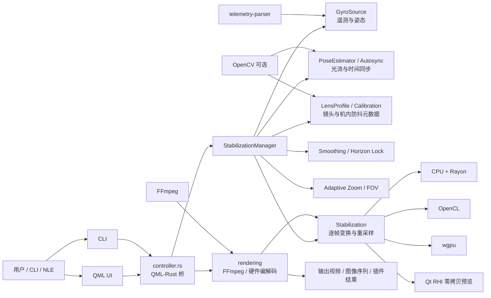
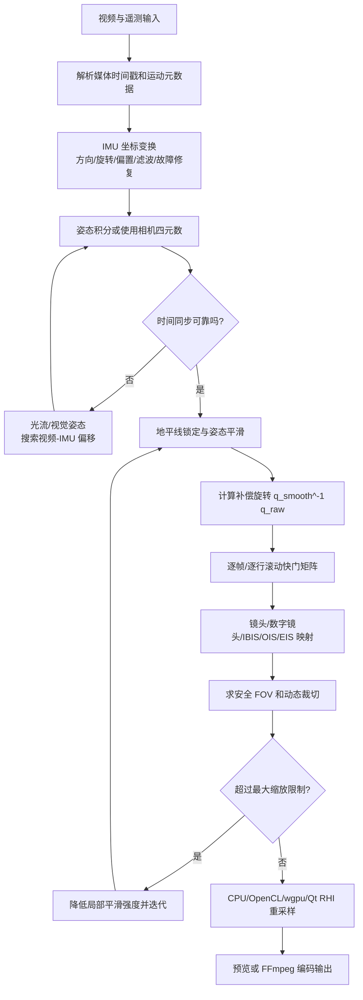
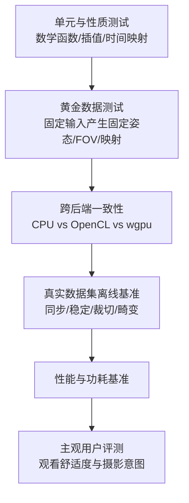
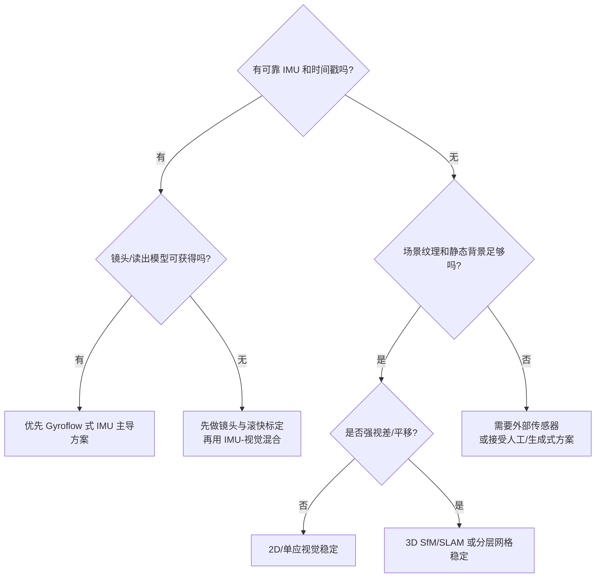
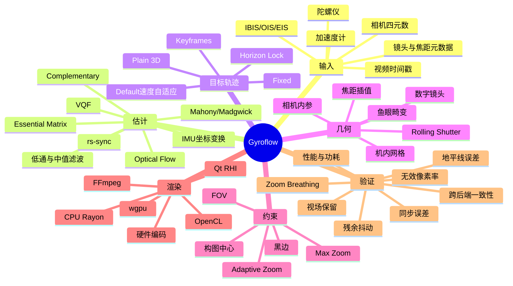
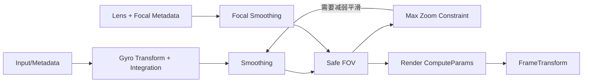

# Gyroflow 当前项目全面分析与设计反推

> 分析日期：2026-08-03  
> 分析对象：本地 `master` 分支，提交 `b5e8828f82c150676e48a7c2e3db39c97392f606`（2026-07-16，`Update telemetry-parser`）  
> 清单版本：`gyroflow 1.6.3`、`gyroflow-core 1.6.3`  
> 分析方法：代码知识图谱、关键调用链和数据结构静态分析、构建配置与 Git 演进历史核对。本文没有把 README 宣传结果当作独立实验结论，也没有执行真实视频质量基准。

---

## 0. 阅读约定：事实、推测、建议严格分开

- **[事实]**：能够由当前仓库代码、配置、提交历史直接验证。
- **[推测]**：从代码结构、算法形式或历史演进反推出的设计意图；合理但不等同于作者正式声明。
- **[建议]**：面向后续研发、评测或重构的方案，不代表项目当前已经实现。
- **[待验证]**：需要真实素材、标定设备、用户研究或性能环境才能确认。

本文最重要的判断是：

1. **[事实] Gyroflow 不是“给视频做一个通用防抖滤镜”，而是“利用时间对齐的相机姿态和镜头模型，渲染一台虚拟相机”。**
2. **[事实] 效果由四个上游条件共同决定：时间同步、IMU 坐标/姿态、镜头几何、逐帧采样映射。平滑算法只是其中一层。**
3. **[事实] 当前项目有较丰富的运行时算法选项和内部代理指标，但核心算法自动化测试与统一效果基准明显不足。**
4. **[推测] 项目的主要竞争力不是某一个独占算法，而是遥测兼容、滚动快门、镜头/机内防抖元数据、交互预览和多后端渲染形成的完整工程闭环。**
5. **[建议] 下一阶段应优先建设可重复的效果验证体系，而不是继续只增加更多参数或后端。没有统一基准时，算法演进容易退化为“个别素材看起来更好”。**

---

## 1. 项目解决了什么问题

### 1.1 用户痛点

普通视频防抖面临以下矛盾：

- 只看图像做防抖，容易被低纹理、运动模糊、动态物体、遮挡和强视差误导。
- 只做帧间 2D 仿射或单应变换，不能准确表达大视场镜头、三维旋转和滚动快门。
- 相机运动越大，稳定后越容易出现黑边；裁切越激进，视场损失越大。
- 广角/鱼眼素材如果镜头模型不准确，防抖旋转与镜头畸变会互相放大误差。
- CMOS 通常不是整帧同时曝光，同一帧的不同行对应不同姿态。
- 视频时间戳与 IMU 时间戳可能存在固定偏移、时钟漂移、帧级偏移或机内处理延迟。
- 高质量重采样计算量大，还要兼顾实时预览、跨平台和硬件编码。

### 1.2 Gyroflow 的问题定义

**[事实]** README 将项目定义为使用陀螺仪、可选加速度计以及内置或外部运动数据进行视频稳定，支持 GoPro、Sony、Insta360 和 Betaflight 等来源，见 `README.md:40`。

从代码反推，项目实际上解决的是一个受约束的时空重映射问题：

> 已知或估计相机在时间轴上的真实姿态、镜头投影模型和传感器读出过程，构造更平滑的目标姿态，再把目标输出像素反投影到原视频中的采样位置，同时控制黑边、裁切、畸变和计算成本。

可简化为：

\[
q_{corr}(t)=q_{smooth}(t)^{-1}q_{raw}(t)
\]

\[
p_{src}=D\left(R(t, y)\,K_{out}^{-1}p_{out}\right)
\]

其中：

- \(q_{raw}\)：原始相机姿态。
- \(q_{smooth}\)：目标虚拟相机姿态。
- \(q_{corr}\)：需要施加到画面的补偿旋转。
- \(R(t,y)\)：考虑滚动快门后，帧内第 `y` 行对应的旋转。
- \(K_{out}\)：输出虚拟相机内参，包含 FOV/裁切。
- \(D\)：物理镜头、数字镜头、机内网格或其他畸变映射。

`GyroSource::recompute_smoothness` 最后显式计算 `smoothed.inverse() * raw`，见 `src/core/gyro_source/mod.rs:655`；逐行旋转矩阵和镜头参数在 `FrameTransform::at_timestamp` 中生成，见 `src/core/stabilization/frame_transform.rs:165`。

---

## 2. 一句话原理、费曼解释与第一性原理

### 2.1 一句话原理

**陀螺仪告诉我们相机“当时朝哪里”，平滑器决定“希望虚拟相机朝哪里”，渲染器把每个输出像素反查回原视频对应的位置。**

### 2.2 费曼学习法：把项目讲给没有图形学背景的人

想象你拿着一张透明照片晃动，同时手上还有一本“手腕运动日记”：

1. 视频是照片序列，陀螺仪是手腕运动日记。
2. 先把日记和照片的时间对齐，否则会“纠正错时刻的抖动”。
3. 用日记重建相机朝向，再画一条更平滑的“理想朝向曲线”。
4. 对每一帧反向旋转画面，使原始朝向看起来像理想朝向。
5. 反向旋转后边缘会缺内容，所以必须放大、裁切、填充或允许黑边。
6. 如果相机是滚动快门，一帧不是同一瞬间拍完的；要把一帧看成很多条在略不同时刻拍摄的横线或竖线。
7. 如果镜头是鱼眼，像素并不按直线投影；必须先知道镜头把光线弯成什么样，才能正确“转动照片”。

### 2.3 第一性原理拆解

任何基于旋转的数字防抖都绕不开四个守恒条件：

1. **时间一致性**：视频帧和 IMU 姿态必须描述同一个物理时刻。
2. **坐标一致性**：传感器 XYZ、相机坐标、图像坐标和设备方向必须正确映射。
3. **几何一致性**：像素必须能转换为视线，视线旋转后又能投影回像素。
4. **采样可实现性**：目标像素对应的原图位置必须存在；不存在时只能裁切、填充或生成内容。

因此，“防抖效果不好”不能直接归因于平滑强度。根因可能在同步、方向、镜头、读出时间、焦距元数据、采样或裁切任一环节。

---

## 3. 项目规模与技术栈

### 3.1 代码规模快照

**[事实]** 当前仓库主要包含：

| 类型 | 文件数 | 约行数 | 说明 |
|---|---:|---:|---|
| Rust | 136 | 37,971 | 核心算法、控制器、渲染、平台适配 |
| QML | 69 | 13,771 | 桌面/移动 UI |
| WGSL | 10 | 1,189 | wgpu 计算与采样着色代码 |
| GLSL | 14 | 900 | Qt RHI/图形路径与镜头模型 |
| OpenCL C | 10 | 1,155 | OpenCL 后端 |
| C++ | 3 | 344 | Qt/C++ 桥接和热重载等 |

注意：仓库的 `.ts` 文件主要是 **Qt Linguist 翻译目录**，不是 TypeScript；仅按扩展名统计会产生技术栈误判。

### 3.2 技术栈

| 层 | 技术 | 作用 |
|---|---|---|
| 主语言 | Rust 2024 | 核心算法、并发、应用逻辑、FFmpeg 集成 |
| 数学 | `nalgebra` | 四元数、旋转矩阵、SVD、向量计算 |
| UI | Qt 6 + QML + `qmetaobject`/`qttypes` | 跨平台交互界面和 Rust/QML 桥接 |
| 视频 | FFmpeg、`ffmpeg-next` | 解码、像素格式转换、编码、封装、音频处理 |
| 预览 | `qml-video-rs`、MDK SDK | UI 视频播放与预览集成 |
| 遥测 | `telemetry-parser` | 相机/飞控/外部 IMU 元数据解析 |
| 同步 | `rs-sync`、OpenCV、Rust CV 生态 | 视频特征运动与 IMU 时间对齐 |
| 姿态融合 | VQF、Complementary、Mahony、Madgwick | 从陀螺仪/加速度计得到姿态 |
| CPU 并行 | Rayon | 平滑、FOV、逐像素计算等并行化 |
| GPU | OpenCL、wgpu、Qt RHI | 高吞吐重映射，覆盖 Vulkan/Metal/DX/OpenGL 生态 |
| Shader | WGSL、GLSL、OpenCL C、SPIR-V | 多后端共享或生成采样内核 |
| 配置/序列化 | Serde、JSON、Bincode/CBOR | 项目文件、设置、缓存和数据交换 |
| 构建部署 | Cargo、Just、平台脚本、GitHub Actions | Windows/macOS/Linux/Android/iOS 构建 |

核心依赖见 `Cargo.toml:1` 和 `src/core/Cargo.toml:1`。README 明确说明 Qt、FFmpeg、OpenCV、MDK SDK 和 GPU 路径，见 `README.md:213`。

---

## 4. 系统架构拆解

### 4.1 容器级架构

### 4.2 目录职责

| 目录/文件 | 责任 | 关键入口 |
|---|---|---|
| `src/gyroflow.rs` | 应用入口、CLI/GUI 分流、QML 类型注册、平台初始化 | `src/gyroflow.rs:50` |
| `src/ui` | QML 页面、组件、时间线、设置、校准和同步 UI | `src/ui/main_window.qml` |
| `src/controller.rs` | QML 与核心库之间的命令桥和状态桥 | `src/controller.rs:48` |
| `src/core/lib.rs` | `StabilizationManager`，聚合参数、陀螺仪、镜头、平滑、同步、重算 | `src/core/lib.rs:82` |
| `src/core/gyro_source` | 遥测解析后的 IMU 数据、坐标变换、滤波、姿态积分、时间偏移 | `src/core/gyro_source/mod.rs:44` |
| `src/core/imu_integration` | VQF、互补滤波、纯陀螺积分、Mahony、Madgwick | `src/core/imu_integration/mod.rs:15` |
| `src/core/synchronization` | 特征检测、光流、视觉姿态估计、偏移搜索、滚动快门同步 | `src/core/synchronization/mod.rs:66` |
| `src/core/smoothing` | 默认速度自适应、Plain 3D、Fixed、None、地平线锁定 | `src/core/smoothing/mod.rs:21` |
| `src/core/zooming` | 安全 FOV、静态/动态裁切、Gaussian/Envelope 方法 | `src/core/zooming/mod.rs:27` |
| `src/core/stabilization` | 每帧矩阵、镜头模型、滚动快门、CPU/GPU 重采样 | `src/core/stabilization/mod.rs:169` |
| `src/core/calibration` | 棋盘格检测与鱼眼镜头标定 | `src/core/calibration/mod.rs:35` |
| `src/rendering` | FFmpeg 解码、帧处理、编码、音频和渲染队列 | `src/rendering/mod.rs:187` |
| `src/qt_gpu` | Qt RHI 零拷贝 GPU 预览路径 | `src/qt_gpu/qrhi_undistort.rs` |
| `src/nle_plugins.rs` | NLE 插件安装与集成 | `src/nle_plugins.rs` |

### 4.3 核心对象关系

```mermaid
classDiagram
    class StabilizationManager {
      +gyro: GyroSource
      +lens: LensProfile
      +smoothing: Smoothing
      +stabilization: Stabilization
      +pose_estimator: PoseEstimator
      +params: StabilizationParams
      +recompute_threaded()
    }

    class GyroSource {
      +raw_imu
      +quaternions
      +smoothed_quaternions
      +offsets
      +apply_transforms()
      +integrate()
      +recompute_smoothness()
    }

    class LensProfile {
      +camera_matrix
      +distortion_coeffs
      +digital_lens
      +interpolations
    }

    class StabilizationParams {
      +input/output size
      +fps/duration
      +rolling shutter
      +zoom/smoothing settings
      +keyframes
    }

    class ComputeParams {
      +immutable-ish compute snapshot
      +camera_diagonal_fovs
      +fovs/minimal_fovs
      +distortion models
    }

    class Stabilization {
      +FrameTransform cache
      +CPU/OpenCL/wgpu backends
      +process_pixels()
    }

    StabilizationManager --> GyroSource
    StabilizationManager --> LensProfile
    StabilizationManager --> StabilizationParams
    StabilizationManager --> Stabilization
    StabilizationManager ..> ComputeParams : snapshot
    ComputeParams --> GyroSource
    ComputeParams --> LensProfile
```

---

## 5. 端到端处理链

### 5.1 输入与遥测解析

**[事实]** `GyroSource::parse_telemetry_file` 是遥测解析主入口，`telemetry-parser` 提供多厂商格式支持，见 `src/core/gyro_source/mod.rs:110`。

**[事实]** 解析结果不仅可能包含原始陀螺仪/加速度计，还可能包含：

- 相机直接记录的四元数。
- 重力向量和图像方向。
- 焦距、镜头位置、数字变焦、主点和畸变系数。
- 每帧时间偏移。
- Sony 等相机的 IBIS/OIS/EIS、网格和焦平面数据。

**[推测]** 这是项目优于“只接受 CSV gyro”的关键：它允许在同一个映射内同时补偿相机姿态、镜头变化和机内稳定元数据，而不是把这些效应重复处理或互相抵消。

### 5.2 IMU 变换、滤波与姿态积分

处理顺序大致是：

1. 根据 IMU orientation 和任意旋转，把传感器轴映射到项目约定坐标系。
2. 对 gyro/accel/magnetometer 应用偏置和坐标变换。
3. 可选低通、双向中值滤波和四元数故障修复。
4. 使用相机已有四元数，或从原始 IMU 积分姿态。

**[事实]** `GyroSource` 默认积分方法为 VQF，地平线锁定积分方法也默认为 VQF，见 `src/core/gyro_source/mod.rs:76`。

**[事实]** 当前提供以下积分选择，见 `src/core/gyro_source/mod.rs:616` 与 `src/core/imu_integration/mod.rs:15`：

| 方法 | 使用信息 | 优点 | 代价/限制 |
|---|---|---|---|
| 相机四元数/元数据 | 厂商已融合姿态 | 直接、可能含厂商校准 | 不透明；可能缺重力或与图像处理链不一致 |
| VQF | gyro + accel | 默认方案，兼顾动态与重力方向 | 依赖加速度质量和参数；磁力计路径当前未启用 |
| Complementary | gyro + accel | 简单、可解释、计算量低 | 激烈线性加速度会污染重力估计 |
| Simple gyro | gyro | 不受线性加速度影响 | 长时间漂移，不能自动找重力方向 |
| Simple gyro+accel | gyro + accel | 比纯 gyro 更能控制漂移 | 仍受线性加速度影响 |
| Mahony/Madgwick | gyro + accel | 常见 AHRS 备选 | 参数和采样质量敏感，未必适合所有相机元数据 |

**[事实]** 代码注释明确指出 Complementary 和 VQF 的磁力计计算当前禁用，见 `src/core/imu_integration/mod.rs:13`。

### 5.3 视频与陀螺仪同步

同步要估计：

\[
\Delta t^*=\arg\min_{\Delta t} E\left(\omega_{visual}(t),\omega_{gyro}(t-\Delta t)\right)
\]

项目提供三类偏移方法：

1. **Essential matrix**：从光流恢复相机旋转，再与 gyro 角速度匹配。
2. **Visual features**：按候选偏移用 gyro 反补偿光流，寻找残余线段最短的偏移。
3. **rs-sync**：把滚动快门逐点时间、三维视线和 gyro 四元数纳入优化。

默认 UI 选择 `rs-sync`，同时默认光流为 OpenCV DIS、姿态估计为 `findEssentialMat`，见 `src/ui/menu/Synchronization.qml:332`。

**[事实]** `rs-sync` 会先尝试更快的 Essential Matrix 初值，再做完整同步，见 `src/core/synchronization/find_offset/rs_sync.rs:17`。

**[事实]** 光流点先去镜头畸变；每个特征点的时间还会按其图像行位置加入读出时间，见 `src/core/synchronization/find_offset/rs_sync.rs:107`。

**[事实]** 快速 Essential Matrix 方法会：

- 跳过视觉最大角速度小于阈值的低运动片段。
- 对视觉角速度和 gyro 角速度做 20 Hz 双向低通。
- 先以 1 ms 步长粗搜，再在局部细化到 0.01 ms 采样步长。
- 对 XYZ 轴使用不同残差权重。
- 拒绝落在搜索区间边缘 10% 内外的不可信结果。

对应实现见 `src/core/synchronization/find_offset/essential_matrix.rs:13`。

**为什么有效**：陀螺仪与视觉运动来自同一个相机旋转，只要镜头模型、坐标方向和特征运动可靠，两条角速度曲线的相位差就是时间偏移。

**代价**：需要解码图像、提取特征和多候选优化；动态场景和视差会使“视觉运动等于相机旋转”的假设变弱。

### 5.4 地平线锁定与姿态平滑

**[事实]** 当前流程固定为“先地平线锁定，再平滑”，见 `src/core/gyro_source/mod.rs:655`。

#### 默认平滑器

默认算法是 velocity-dampened smoothing，核心思路在文件头有十步说明，见 `src/core/smoothing/default_algo.rs:4`：

1. 计算相邻四元数的角速度。
2. 双向平滑角速度，减少因果相位延迟。
3. 根据 FOV 和平滑参数归一化速度。
4. 低速时使用更长时间常数，强力滤除小抖动。
5. 高速时使用更短时间常数，保留有意快速摇摄。
6. 第一遍得到初步平滑轨迹。
7. 计算初步轨迹与原轨迹的姿态距离。
8. 只强化较大的距离区域并平滑该权重。
9. 第二遍按“速度 × 距离”自适应平滑。
10. 支持 per-axis、关键帧、视频速度和 FOV 联动。

**[事实]** FOV 会进入最大速度阈值：长焦下相同角度会产生更大画面位移，因此更需要降低允许速度，见 `src/core/smoothing/default_algo.rs:299`。

**[事实]** 正向和反向两遍滤波避免单向低通引入明显时间滞后，见 `src/core/smoothing/default_algo.rs:336`。

#### 其他平滑器

| 方法 | 原理 | 适用场景 | 主要问题 |
|---|---|---|---|
| None | 不修改目标姿态 | 调试、只做镜头/滚快修正 | 不防抖 |
| Default | 速度与姿态距离自适应双向平滑 | 通用手持、运动相机 | 参数耦合较多，离线/非因果 |
| Plain 3D | 固定时间常数的四元数双向平滑 | 需要可解释、稳定响应 | 快速有意运动与抖动难兼顾 |
| Fixed | 固定或关键帧控制的目标 R/P/Y | 虚拟锁定镜头、特殊构图 | 裁切极大，完全忽略原始摄影意图 |

接口见 `src/core/smoothing/mod.rs:21`；Plain 见 `src/core/smoothing/plain.rs:73`；Fixed 见 `src/core/smoothing/fixed.rs:82`。

### 5.5 镜头模型与标定

**[事实]** 物理镜头模型包括 OpenCV Fisheye、OpenCV Standard、Poly3、Poly5、PTLens、Insta360、Sony、Generic Polynomial、GoPro；数字镜头包括 Superview、Hyperview、GoPro Warp 和 Digital Stretch，见 `src/core/stabilization/distortion_models/mod.rs:92`。

**[事实]** 镜头参数可以随镜头位置或焦距插值，见 `src/core/lens_profile.rs:495`。

**[事实]** 镜头标定使用 OpenCV 鱼眼标定：扫描棋盘格，按清晰度筛选，随机/分段选帧，多次迭代并选择 RMS 最低的解。默认最多 10 张、1000 次迭代，见 `src/core/calibration/mod.rs:4` 与 `src/core/calibration/mod.rs:69`。

**为什么有效**：姿态旋转作用在相机射线上，不是直接作用在畸变后的像素平面。镜头模型把“像素 ↔ 射线”建立起来，广角边缘才能正确运动。

**代价**：镜头配置错误会形成系统性误差；即使同步和平滑正确，边缘仍可能摆动、拉伸或出现黑边判断错误。

### 5.6 滚动快门与机内防抖元数据

滚动快门逐行时间近似为：

\[
t_y=t_{frame}-\frac{T_r}{2}+\frac{y}{H}T_r
\]

横向读出时把 `y/H` 换为 `x/W`。

**[事实]** 当读出时间非零时，项目为每一行或每一列生成一套旋转矩阵；否则只生成一套矩阵，见 `src/core/stabilization/frame_transform.rs:241`。

**[事实]** 代码同时考虑：

- 正向/反向、横向/纵向读出。
- framebuffer 反转。
- 每帧额外时间偏移。
- capture area 与 sensor size 对读出时间的缩放。
- Sony 等相机的 IBIS、OIS、旋转和网格数据。

对应实现集中在 `src/core/stabilization/frame_transform.rs:22`、`src/core/stabilization/frame_transform.rs:220`。

**为什么有效**：果冻、倾斜和波浪不是整帧单一旋转造成的；逐行姿态能把一帧恢复为更接近同一虚拟时刻的几何关系。

**代价**：读出时间或方向一旦错误，修正会反向放大果冻；逐行矩阵也增加内存、计算和 GPU 参数传输成本。

### 5.7 自适应 FOV、动态裁切与最大缩放约束

**[事实]** 安全 FOV 算法先在原图边界采样多边形，将边界经过完整滚动快门和镜头映射，再寻找以输出中心为中心、完全落在有效多边形内的最大同宽高比矩形，见 `src/core/zooming/fov_iterative.rs:10`。

算法不是只检查四个角，而是：

- 初始在边界上布置约 31×31 的轮廓点。
- 找到限制矩形的最近边缘区域。
- 对该局部边缘插值更多点。
- 迭代收缩，降低粗采样漏判黑边的风险。

**[事实]** 动态变焦提供 Gaussian Filter 和 Envelope Follower；当前默认 `adaptive_zoom_method = 1`，即 Envelope Follower，见 `src/core/stabilization_params.rs:144` 与 `src/core/zooming/mod.rs:19`。

**[事实]** 最大缩放限制不是简单截断 FOV，而是最多迭代若干次，降低造成过度裁切帧附近的平滑强度，然后重新计算安全 FOV，见 `src/core/lib.rs:548` 和 `src/core/lib.rs:636`。

这是一个重要设计权衡：

> 稳定程度、保留视场和黑边不可同时最大化。Gyroflow 在超出最大缩放时选择“牺牲局部平滑”，而不是输出非法画面或无限裁切。

### 5.8 像素重采样与计算后端

**[事实]** 每帧变换被打包成 `FrameTransform`：逐行矩阵、镜头参数、FOV、背景、数字镜头参数和机内稳定元数据，见 `src/core/stabilization/frame_transform.rs:11`。

**[事实]** 后端初始化顺序通常是：

1. 尝试 OpenCL（若编译启用、环境未禁用且缓冲区支持）。
2. 尝试 wgpu。
3. 回退 CPU + Rayon。

见 `src/core/stabilization/mod.rs:467` 和 `src/core/stabilization/mod.rs:612`。

**[事实]** CPU 路径支持 Bilinear、Bicubic、Lanczos4、RobidouxSharp、Robidoux、Mitchell、Catmull-Rom 等插值，见 `src/core/stabilization/mod.rs:704`。

设计权衡：

| 维度 | 低成本选择 | 高质量选择 | 权衡 |
|---|---|---|---|
| 插值 | Bilinear | Lanczos/EWA 类高阶采样 | 速度、锐度、振铃、缩小抗混叠 |
| 后端 | CPU | OpenCL/wgpu/Qt RHI | 可移植性、驱动稳定性、吞吐和拷贝成本 |
| 预览 | 低分辨率/零拷贝 | 全分辨率精确预览 | 交互延迟与最终一致性 |
| 输出 | 软件编码 | 硬件编码 | 兼容性、码率质量、像素格式与速度 |

---

## 6. 重算、缓存与并发设计

### 6.1 重算序列

```mermaid
sequenceDiagram
    participant UI as QML / Controller
    participant M as StabilizationManager
    participant G as GyroSource
    participant Z as Zooming
    participant S as Stabilization
    participant R as Preview/Renderer

    UI->>M: 修改同步/镜头/平滑/关键帧参数
    M->>M: 生成 ComputeParams 快照
    M->>M: 写入随机 compute_id
    M->>G: 如 checksum 变化，重算目标姿态
    G-->>M: 补偿四元数 + 最大角度
    M->>M: 焦距曲线去量化与平滑
    M->>Z: 计算逐帧安全 FOV
    alt 超过最大缩放
        M->>G: 降低局部平滑并重新计算
        M->>Z: 再计算 FOV
    end
    M->>S: 原子式替换计算参数
    S-->>R: 新 FrameTransform / 新画面
```

### 6.2 关键机制

**[事实]** `StabilizationManager` 使用 `Arc<RwLock<_>>` 共享大对象，并使用原子变量管理：

- 当前计算 ID。
- 平滑 checksum。
- 变焦 checksum。
- 各阶段 invalidation。
- 加载期阻止重算。

见 `src/core/lib.rs:82`。

**[事实]** 每次异步重算生成随机 `compute_id`；长计算的多个检查点发现 ID 已过期就取消结果提交，见 `src/core/lib.rs:636`。

**为什么有效**：UI 连续拖动参数时，旧任务即使不能立刻中断，也不会覆盖新参数产生的结果。

**代价与风险**：

- 中央 `recompute_threaded` 同时耦合平滑、焦距、变焦、最大缩放和状态提交，认知复杂度较高。
- `RwLock`、线程池、缓存与原子状态组合增加竞态排查成本。
- 多处存在手写 `unsafe impl Send/Sync`，例如 `Smoothing`、`FrameResult` 和 `Stabilization`；**[建议]** 应建立专门并发安全审计和 Loom/Miri 可行性评估，而不是仅依赖运行经验。
- checksum/缓存显著降低重算，但必须保证所有影响输出的参数都进入 checksum；历史中多次出现“补充 GPU cache key”类修复，说明这是长期维护风险。

---

## 7. 为什么这个方案有效

### 7.1 相比纯视觉防抖的优势

1. IMU 高频采样，不需要每帧都从模糊图像恢复运动。
2. 旋转信息不依赖场景纹理，也不容易被前景移动物体主导。
3. 可在解码前或低分辨率预览阶段预计算完整姿态轨迹。
4. 可以自然插值到每一行的曝光时刻，适合滚动快门。
5. 能保留长时间、跨帧的绝对姿态连续性，而不是只累计局部图像变换。

### 7.2 相比只用 IMU 的朴素实现的优势

1. 光流/视觉姿态用于自动时间同步和方向猜测。
2. 镜头模型把旋转作用在三维射线而不是像素平面。
3. 动态焦距、数字镜头和机内稳定元数据进入同一几何链。
4. 自适应裁切显式计算有效边界，不依赖固定经验放大倍数。
5. 最大缩放把“画面稳定”和“保留视场”闭环联动。
6. 多后端重采样使算法能在桌面、移动和 NLE 场景实际落地。

### 7.3 真正的效果闭环

**[推测]** 项目形成了三个互相制约的闭环：

- **估计闭环**：视觉运动帮助修正 IMU 时间与方向。
- **几何闭环**：姿态、镜头、滚快和机内防抖共同决定真实采样位置。
- **约束闭环**：FOV 发现裁切过大后反向约束平滑强度。

单独实现“gyro 积分 + 旋转图像”并不难，难点是这三个闭环以及跨平台实时性。

---

## 8. 当前项目已经如何“检测有效性”

### 8.1 已有内部代理指标

| 子系统 | 已有指标/守卫 | 作用 | 局限 |
|---|---|---|---|
| 镜头标定 | 重投影 RMS | 选择标定结果 | 低 RMS 不保证边缘、不同焦距或真实视频都好 |
| 同步 | offset cost、搜索边界拒绝、低运动跳过 | 排除明显错误同步点 | 缺统一置信度、真值误差和跨片段稳定性报告 |
| 多同步点 | 多时间点 offset、线性拟合/离群筛选 | 观察时钟漂移 | 当前用户很难直接理解拟合质量 |
| 平滑 | `max_angles`、平滑状态 JSON | 描述补偿幅度 | 不是画面残余抖动指标 |
| 变焦 | `fovs`、`minimal_fovs`、debug polygon | 避免黑边、观察裁切约束 | 未直接统计无效像素率或 zoom breathing |
| 渲染 | backend 名称、错误回退 | 诊断 CPU/GPU 路径 | 没有默认的跨后端像素一致性门禁 |

### 8.2 自动化验证现状

**[事实]**：

- `Justfile` 提供 `just test`，最终运行 `cargo test`，见 `Justfile:8` 与 `_scripts/linux.just:143`。
- 仓库中可发现的 Rust 测试集中在 `src/ui/ui_tools.rs:294`，主要验证数字字段编辑逻辑。
- 未发现面向同步、姿态积分、平滑、镜头映射、滚动快门、FOV 或 CPU/GPU 一致性的系统测试目录。
- 当前 `.github/workflows/release.yml` 主要做多平台构建和发布，未发现执行 `cargo test` 的步骤。

结论：**[事实] 当前“能构建、能运行、人工看结果”的验证强于“算法可重复回归”。**

这不意味着算法无效，而意味着代码仓库本身不能独立证明每次修改都没有降低效果。

---

## 9. 建议的有效性验证体系

### 9.1 验证金字塔

### 9.2 数据集分层

**[建议]** 建立至少以下标签维度，所有结论按标签分层而不是只报平均值：

- 相机：GoPro、Sony、Insta360、手机、无人机、外置 Betaflight。
- 快门：global shutter、短/中/长 rolling shutter、横向读出。
- 镜头：定焦、变焦、鱼眼、数字 Superview/Hyperview、动态焦距。
- 运动：静止、小手抖、步行、跑步、骑行、FPV 高频振动、快速摇摄、故意倾斜。
- 场景：高纹理、低纹理、夜景、运动模糊、动态人群、水面、重复纹理。
- 几何：远景、近景、强视差、前景遮挡、低景深。
- 时间：CFR、VFR、长视频、变速、分段 trim、时间码不连续。
- 元数据：完整、缺失、错误方向、错误镜头、错误读出时间、gyro 饱和/掉点。

### 9.3 同步指标

有真值时：

- Offset MAE / P95 / 最大误差，单位 ms 和帧比例。
- 长视频时钟漂移斜率误差，单位 ms/min 或 ppm。
- 自动方向识别准确率。
- rolling shutter readout time 估计误差。

无真值时可用代理指标：

- 视觉角速度与 gyro 角速度的归一化互相关峰值。
- 最优 offset 与次优 offset 的 cost margin。
- 多同步点残差、离群比例、单调性与漂移拟合残差。
- 去旋转后的光流残差长度及方向一致性。

**[建议]** 同步结果应输出置信等级，而不只是 offset 数值。例如：

- High：多片段一致、峰值尖锐、残差低、未靠近搜索边界。
- Medium：只有一个有效片段或纹理不足。
- Low：低运动、动态场景占比高、多个局部最优相近。

### 9.4 稳定效果指标

不要把 PSNR/SSIM 当作主要防抖指标，因为稳定后的画面本来就与原图不同。建议使用：

1. **残余全局运动**：在稳定输出上重新追踪静态背景，计算旋转/平移 RMS、P95。
2. **频域抖动能量**：比较高频角速度或背景轨迹 PSD，观察目标频段衰减。
3. **运动平滑度**：目标姿态角速度、角加速度、角 jerk 的 RMS/P95。
4. **摄影意图保真**：低频摇摄幅度、转向时延、超调和回摆。
5. **地平线误差**：有可见地平线或重力真值时，统计 roll RMS/P95。
6. **黑边/无效像素率**：逐帧无源像素比例、连续黑边时长。
7. **视场保留率**：输出有效 FOV / 原始 FOV，统计均值和最差帧。
8. **zoom breathing**：FOV 一阶/二阶变化和局部峰值。
9. **几何残差**：直线弯曲、边缘漂移、滚动快门斜线/波浪残差。

### 9.5 渲染正确性指标

- CPU 与 wgpu/OpenCL 的坐标映射误差、像素绝对误差和边界一致性。
- 不同插值器的锐度、振铃和 aliasing 测试图。
- 不同像素格式、色彩范围、位深和 alpha 的 round-trip 测试。
- 逐帧时间戳、帧数、音画同步和 trim 边界。
- 后端故障注入：禁用 OpenCL、wgpu 初始化失败、设备切换、缓存 miss。

### 9.6 性能指标

- 预览首帧时间、参数到画面更新时间。
- 每帧 CPU/GPU wall time，P50/P95/P99。
- 1080p/4K/8K、8/10/16/32-bit 吞吐。
- 峰值内存、GPU 内存、缓存命中率。
- 解码、重映射、编码三阶段占比。
- 移动端功耗和热降频。

### 9.7 建议的发布门禁

**[建议]** 不宜一开始规定脱离基线的绝对阈值。先冻结一版代表性数据集和当前提交结果，然后采用：

- 同步 MAE、残余抖动、黑边率不得显著退化。
- 视场保留率和摄影意图至少一项有统计显著提升，另一项不劣化。
- CPU/GPU 像素差异保持在位深和插值允许范围。
- 性能 P95 不得超过约定预算。
- 每个相机/运动标签都必须报告，禁止只用全局均值掩盖 Badcase。

---

## 10. 消融实验设计

### 10.1 最小可解释消融矩阵

所有实验应固定输入视频、输出分辨率、编码器、镜头配置和随机种子，只改变一个因素。

| 实验 | 基线 | 变量 | 主要观察指标 | 要回答的问题 |
|---|---|---|---|---|
| A0 | 原视频 | 无稳定 | 残余运动、主观分 | 原始难度是多少 |
| A1 | A0 | 仅旋转补偿，不平滑 | 映射正确性、黑边 | 时间/方向/镜头是否正确 |
| A2 | VQF | Complementary/Simple/Mahony/Madgwick/相机四元数 | 姿态漂移、地平线、残余抖动 | 哪种积分适合哪类数据 |
| A3 | 自动同步 | 真值/manual/Essential/Visual/rs-sync | offset MAE、稳定残差、耗时 | 完整同步的边际收益 |
| A4 | 正确镜头 | 无镜头/错误镜头/静态/动态镜头 | 边缘残差、直线误差、黑边 | 镜头模型贡献多大 |
| A5 | 正确 rolling shutter | 关闭/错误时间/错误方向 | 果冻、斜线残差 | 滚快修正在哪些场景必要 |
| A6 | Default smoothing | None/Plain/Fixed/Default 单遍/Default 双遍 | 高频抖动、低频意图、裁切 | 自适应和平滑第二遍是否有效 |
| A7 | 无 horizon lock | 固定锁定/自动锁定/pitch lock | 地平线误差、转弯自然度 | 地平线功能的收益与副作用 |
| A8 | 动态变焦 | 静态/禁用/Gaussian/Envelope | 黑边、FOV 保留、breathing | 动态裁切是否值得 |
| A9 | 无最大 zoom 联动 | 1/3/5 次平滑-FOV 迭代 | 最大缩放、残余抖动、耗时 | 闭环迭代收益是否递减 |
| A10 | CPU Bilinear | CPU 高阶/OpenCL/wgpu | 画质、像素差、吞吐 | 后端/插值如何选 |
| A11 | 原始焦距元数据 | 去量化/平滑开关与强度 | zoom stair-step、呼吸 | 焦距平滑是否解决真实问题 |
| A12 | 无 glitch repair | 不同 strength | 瞬时跳变、误修率 | 故障修复是否伤害快速真实运动 |

### 10.2 因果顺序

建议按以下顺序实验，避免把上游错误错误归因给下游：

1. 先用人工真值同步验证几何和渲染。
2. 再固定镜头与读出真值，验证姿态积分和平滑。
3. 再验证自动同步。
4. 最后打开动态镜头、焦距平滑、机内稳定和最大缩放闭环。

### 10.3 统计设计

- 每个标签至少包含多个视频和多个时间片，避免单素材结论。
- 报告均值、P50、P95、最差样本和置信区间。
- 主观实验采用随机顺序、盲测和成对比较。
- 对速度和质量分别做 Pareto 前沿，不把高耗时方案直接判为“更好”。
- 对失败样本保存中间产物：光流、offset cost 曲线、姿态曲线、边界多边形、FOV、采样坐标和后端信息。

---

## 11. 其他方案选型与设计权衡

### 11.1 方案全景

| 方案 | 输入 | 优点 | 缺点 | 最适场景 |
|---|---|---|---|---|
| 2D 特征 + 仿射 | 视频 | 简单、无需传感器 | 不能表达强透视/鱼眼/滚快；动态物体干扰 | 普通窄角、轻微抖动 |
| 单应性稳定 | 视频 | 可表达平面或纯旋转 | 强视差和非平面场景失败 | 远景、平面场景、纯旋转 |
| 视觉 3D/SfM/SLAM | 视频 | 可估计旋转和平移，场景自包含 | 计算重、尺度/动态/模糊困难，离线优化复杂 | 电影后期、无 IMU 高质量离线 |
| 纯 IMU 姿态稳定 | gyro/accel | 高频、低延迟、弱纹理可用 | 时间/轴向/漂移/镜头问题；不能估平移 | 运动相机、可靠遥测 |
| 视觉-惯性混合 | 视频 + IMU | 同步、漂移和鲁棒性最好潜力 | 标定与系统复杂度最高 | 高质量通用稳定 |
| 机内 OIS/IBIS/EIS | 传感器/镜组/ISP | 实时、拍摄时直接生效 | 黑盒、不可重做、裁切和伪影固化 | 消费相机实时输出 |
| 深度学习稳定 | 视频，可选 IMU | 可学习复杂先验与内容感知裁切 | 数据偏差、可解释性、时序稳定和算力 | 内容感知、生成式补边、特定域 |
| Gyroflow 当前混合方案 | IMU + 可选视觉 + 镜头元数据 | 高频姿态、自动同步、滚快、镜头和工程闭环 | 依赖元数据质量；平移/视差能力有限 | 运动相机、无人机、支持遥测的相机 |

### 11.2 为什么当前方案合理

**[推测]** 选型依据是目标用户和输入数据决定的：

- GoPro、Sony、Insta360、FPV 等设备本身就能提供高频 IMU。
- 运动素材常有模糊、低纹理和快速旋转，纯视觉最不稳定的场景恰好是核心场景。
- 用户接受离线处理，但需要实时预览和可交互参数调整。
- 广角、鱼眼、滚动快门和机内稳定元数据比一般桌面视频更重要。

所以项目选择“IMU 为主，视觉负责校准/同步，几何模型负责精确渲染”，而不是“视觉包办全部运动估计”。

### 11.3 何时应选择其他方案

### 11.4 建议的新方案方向

1. **[建议] 同步置信度模型**：融合光流内点率、cost margin、片段一致性和运动强度，自动提示“不适合自动同步”。
2. **[建议] 分层/网格残余稳定**：IMU 先消除主旋转，再用低自由度网格修正小平移和视差；应强约束以避免果冻。
3. **[建议] 离线全局优化平滑器**：以角速度、角加速度、裁切约束和摄影意图构成优化目标，替代部分启发式迭代。
4. **[建议] 学习只做辅助**：用于动态区域 mask、光流置信度、内容感知构图或补边，不建议直接替代可解释的姿态和几何主链。
5. **[建议] 校准包**：把镜头、IMU-camera 外参、rolling shutter、时钟漂移作为统一标定产物管理。

---

## 12. 核心设计决策与权衡记录

### 决策 D1：IMU 主导，视觉辅助

- **依据**：目标设备普遍有高频 gyro；核心场景对视觉不友好。
- **收益**：低纹理、模糊和动态场景下仍能得到高频旋转。
- **代价**：强依赖同步、轴向、偏置和镜头标定。
- **备选**：纯视觉或全视觉惯性优化。
- **结论**：当前选型符合产品域。

### 决策 D2：在四元数姿态域平滑，而非像素平面平滑

- **依据**：三维旋转应在 SO(3) 上表达，避免欧拉角奇异和视场相关误差。
- **收益**：可插值、可逐行采样、与镜头投影解耦。
- **代价**：仍不能表达相机平移和景深差异。

### 决策 D3：先地平线锁定，再平滑

- **依据**：先定义重力/目标地平线，再让最终轨迹平滑。
- **收益**：地平线约束不会在平滑后重新引入突变。
- **代价**：自动锁定和有意倾斜可能互相冲突。

### 决策 D4：非因果双向平滑

- **依据**：离线视频允许使用未来样本。
- **收益**：减少相位延迟和摇摄滞后。
- **代价**：不适合严格直播；trim 边界需要特殊处理。

### 决策 D5：安全 FOV 与平滑闭环迭代

- **依据**：过度平滑会导致不可接受的裁切。
- **收益**：把最大 zoom 变成可满足约束，而不是事后截断。
- **代价**：计算链耦合，参数改变需要多轮重算，局部稳定性会被主动降低。

### 决策 D6：多 GPU API + CPU 回退

- **依据**：跨平台、不同驱动、桌面与移动端需求。
- **收益**：覆盖广、发生后端故障仍可工作。
- **代价**：Shader/内核一致性、缓存键、驱动问题和测试矩阵显著扩大。

### 决策 D7：核心与 UI/FFmpeg 解耦

- **依据**：同一核心需要用于 GUI、CLI、插件和不同渲染路径。
- **收益**：复用和平台移植性高。
- **代价**：`Controller` 和 `StabilizationManager` 仍承担大量编排职责，边界不是完全微内核化。

---

## 13. 代价、限制与 Badcase

### 13.1 理论限制

1. **纯旋转模型不能恢复平移缺失信息**：近景步行、上下起伏和强视差无法仅靠旋转完全稳定。
2. **无法凭空得到画外内容**：裁切、背景填充和生成式补边只能做取舍。
3. **加速度计不总是重力计**：跑步、转弯、无人机加速会污染重力方向。
4. **gyro 积分会漂移**：没有可靠重力/视觉约束时，长时间绝对姿态可能偏移。
5. **镜头模型是近似**：去中心、温度、对焦、变焦、制造差异和水下折射都可能让标定失配。

### 13.2 同步 Badcase

- 几乎静止：视觉角速度不足，offset 不可辨识；代码会跳过低运动同步点。
- 大面积动态前景：光流代表物体而不是相机。
- 夜景、运动模糊、纯色墙、水面、重复纹理：特征点少或错误匹配。
- 强平移和近景视差：视觉角速度估计被平移污染。
- 搜索范围没有覆盖真实 offset：算法可能返回边缘或拒绝结果。
- 视频经剪辑、变速、补帧或丢帧：单一 offset 或简单漂移模型不足。
- 相机机内 EIS 改变画面但元数据缺失：视觉运动与裸 gyro 不再一致。

### 13.3 姿态与平滑 Badcase

- gyro 饱和、采样率不足、时间戳抖动、高频振动 aliasing。
- IMU orientation 配错导致轴交换或符号反向。
- 故障修复把真实快速旋转误判为 glitch。
- 地平线锁定抹掉摩托、FPV、滑雪等有意 bank angle。
- Default smoothing 的启发式参数在极端长焦、极端慢动作或强变速下可能失配。
- 双向滤波会利用未来帧，不适合低延迟直播。

### 13.4 镜头和滚动快门 Badcase

- 使用错误相机模式、分辨率、裁切或数字镜头配置。
- 变焦镜头只有离散或量化焦距元数据，导致 FOV 阶梯。
- 读出时间符号或方向错误，果冻被放大。
- 横向读出、旋转元数据和 framebuffer inversion 组合错误。
- 超广角边缘超过模型单调区，映射可能失效；代码通过径向导数寻找有效半径，但仍依赖模型正确。
- 水下折射不是统一平面界面或折射率变化时，单系数模型不够。

### 13.5 裁切和画面 Badcase

- 极端旋转需要巨大裁切，最大 zoom 会迫使局部稳定下降。
- 动态变焦窗口过短会呼吸，过长会提前大幅裁切。
- 画面主体靠边时，以中心最大矩形为目标未必符合构图需求。
- 背景填充能隐藏黑边，但不等价于真实内容，运动边缘可能暴露伪影。

### 13.6 工程 Badcase

- GPU 驱动、纹理格式或共享缓冲区不支持时回退 CPU，性能可能突降。
- OpenCL/wgpu/Qt RHI/CPU 的采样实现可能出现边缘和精度差异。
- 复杂缓存键漏参数会复用过期内核或变换；缓存过于保守又会增加初始化抖动。
- `unsafe Send/Sync` 与 `RefCell`/锁组合需要持续审计。
- 大量平台构建提高发布覆盖，但当前核心算法回归测试不足。

---

## 14. 容易误解的地方

1. **“用了 gyro 就不需要视觉”是错的。** 视觉仍用于自动同步、方向估计和诊断；没有正确同步，gyro 越精确，错误越明显。
2. **“平滑越强越稳定”不完整。** 平滑越强通常意味着裁切越大、摄影意图越弱、快速运动跟随越差。
3. **“rolling shutter correction 是普通旋转”是错的。** 它需要帧内逐行/列姿态。
4. **“镜头校正只是画质功能”是错的。** 镜头模型直接影响旋转映射、同步和安全 FOV。
5. **“低标定 RMS 等于真实视频一定好”是错的。** RMS 只描述标定样本重投影误差。
6. **“PSNR 高代表防抖好”是错的。** 稳定结果发生了空间变换，像素相似度不能衡量观看稳定性。
7. **“GPU 只改变速度”不一定。** 浮点精度、边界处理和插值实现也可能改变像素结果。
8. **“项目的 `.ts` 很多，所以使用 TypeScript”是错的。** 这些主要是 Qt 翻译文件。
9. **“core 完全无外部依赖”需要语义限定。** 核心与 Qt/FFmpeg 解耦且主体是 Rust，但仍依赖多个 Rust crate，并可选依赖 OpenCV/OpenCL/wgpu。
10. **“能构建就是算法有效”是错的。** 构建验证只能说明接口和平台依赖基本一致，不能证明同步、稳定和几何质量。

---

## 15. 关键词科普

| 关键词 | 简明解释 | 在本项目中的位置 |
|---|---|---|
| IMU | 惯性测量单元，常含 gyro、accelerometer、magnetometer | `src/core/gyro_source` |
| Gyroscope | 测量角速度，短时间旋转估计精度高 | 姿态积分主输入 |
| Accelerometer | 测量比力，静止时可近似重力方向 | VQF/互补滤波、地平线 |
| Quaternion | 表示三维旋转的四元数，适合组合和球面插值 | `Quat64`、姿态轨迹 |
| SLERP | 四元数球面线性插值，平滑旋转且避免简单线性插值畸变 | 时间插值、平滑 |
| SO(3) | 三维旋转群，说明旋转不是普通欧氏向量 | 姿态平滑的数学空间 |
| Optical Flow | 估计像素或特征在相邻帧如何移动 | 自动同步 |
| Essential Matrix | 标定相机下约束两帧对应点的极几何 | 视觉旋转估计 |
| Homography | 平面或纯旋转下的 2D 投影变换 | 备选姿态方法 |
| RANSAC/ARRSAC | 从含外点的数据中鲁棒估计模型 | 特征匹配/姿态估计 |
| Rolling Shutter | 传感器逐行/列曝光导致帧内时间不同 | 逐行矩阵修正 |
| Camera Intrinsics | 焦距、主点等像素到相机射线的参数 | `LensProfile`、camera matrix |
| Distortion Model | 描述物理或数字镜头如何弯曲射线 | `distortion_models` |
| Reprojection Error | 三维/模型点投影回图像与观测点的误差 | 镜头标定 RMS |
| FOV | 视场；在项目中也承担数字缩放/裁切的表达 | `fovs`、`minimal_fovs` |
| Adaptive Zoom | 随时间调整裁切以避免黑边并减少无谓放大 | `src/core/zooming` |
| Envelope Follower | 受安全上界约束、平滑跟随 FOV 的方法 | 默认动态变焦 |
| EWA | 椭圆加权平均，适合各向异性缩小采样 | 高质量重采样路径 |
| IBIS/OIS/EIS | 机身防抖、镜头防抖、电子防抖 | Sony/厂商元数据补偿 |
| VFR | 可变帧率；不能只按帧号假定固定时间 | 项目按时间戳计算 |
| Non-causal Filter | 使用未来和过去样本的离线滤波 | 双向姿态平滑 |
| Pareto Frontier | 在稳定、裁切、速度等互相冲突目标间找不可支配解 | 方案评测方法 |

---

## 16. Mermaid 知识地图

---

## 17. 工程质量与演进观察

### 17.1 优点

- **[事实]** 核心算法与 UI/FFmpeg 分层明确，支持 GUI、CLI、插件和多平台复用。
- **[事实]** 时间戳贯穿姿态、关键帧、VFR、变速和同步，而不是只依赖帧号。
- **[事实]** 多种积分、光流、姿态、同步、平滑、变焦和插值方法均有策略接口或枚举，便于对比和回退。
- **[事实]** 具备异步取消、checksum invalidation、GPU 实例缓存、CPU fallback 和错误日志。
- **[事实]** Git 历史显示项目持续解决真实设备兼容问题，例如 Sony IBIS/OIS/EIS、焦距平滑、EWA、横向滚动快门、glitch filtering 和 GoPro 原生镜头模型。

### 17.2 风险

- 核心编排集中在 `StabilizationManager` 和 `Controller`，功能增长会继续增加修改半径。
- 多算法、多设备、多像素格式、多平台产生组合爆炸，但测试体系没有同步增长。
- 同步、几何、平滑和裁切互相影响，缺少统一中间产物协议与可重放基准。
- 依赖若干 Git revision 的外部项目，构建可重复性和上游变更管理需要锁定与镜像策略。
- 闭源 MDK SDK 链接许可和不同发布渠道需要持续治理，README 已明确额外许可，见 `README.md:301`。

### 17.3 演进历史反推

近期历史体现出以下方向：

- 2024：Sony IBIS/OIS/EIS、横向滚快、GPU 缓存、EWA、高级 zoom limit。
- 2025：自动同步修复、光流过滤、焦距平滑、自动地平线锁定。
- 2026：焦距平滑重构、GoPro/Sony 新镜头模型、gyro glitch repair、移动端 CI。

**[推测]** 项目已从“基础 gyro 防抖器”演化为“多厂商相机几何与运动元数据解释器 + 高性能视频重映射平台”。因此测试和架构文档也应从功能级升级到数据驱动的平台级治理。

---

## 18. 建议的重构与路线图

### P0：建立算法回归基线

1. 保存小型公开/可授权测试素材和对应项目文件。
2. 导出稳定中间格式：parsed telemetry、raw quats、offsets、smoothed quats、FrameTransform、FOV。
3. 给同步、四元数插值、rolling shutter 时间、镜头正反映射、FOV 添加黄金测试。
4. 在 CI 至少运行 core 无 GUI 测试和小规模 CPU 基准。

### P1-A：增加可观测性与置信度

1. 同步界面显示 cost 曲线、峰值间隔、多点残差和低运动提示。
2. 输出每帧裁切率、最小 FOV、最大补偿角和后端。
3. 提供“诊断包”导出，包含版本、镜头、时间轴、算法选项和中间曲线。
4. 为 GPU fallback、缓存 miss 和参数过期任务增加统一 telemetry。

### P1-B：拆分中央重算图

**[建议]** 把 `recompute_threaded` 形式化为显式依赖 DAG：

每个节点声明：输入版本、输出版本、缓存键、取消点、耗时和错误。这比散布原子 invalidation 更容易测试和解释。

### P2-A：残余视觉修正

在 IMU 主旋转完成后，对静态背景估计低自由度残余：

- 仅允许小平移、微小旋转或平滑网格。
- 使用动态物体 mask 和空间正则。
- 把残余量限制在不会产生明显果冻的范围。
- 作为可选第二阶段，不破坏现有确定性主链。

### P2-B：形式化优化平滑

构造目标：

\[
J = w_1 E_{jitter}+w_2 E_{jerk}+w_3 E_{crop}+w_4 E_{intent}+w_5 E_{horizon}
\]

并加入每帧安全 FOV、最大 zoom、关键帧和角速度约束。这样可以把当前“平滑→FOV→降低平滑→重算”的启发式循环转为可解释优化问题。代价是求解器复杂度和交互速度，需要与当前算法做 Pareto 对比。

---

## 19. 最终判断

### 19.1 项目价值

**[事实]** 当前项目已实现完整的多厂商 gyro 视频稳定产品链：遥测解析、IMU 处理、视觉同步、姿态平滑、地平线、镜头/滚快/机内防抖几何、自适应裁切、多后端预览和 FFmpeg 输出。

**[推测]** 它的核心护城河在“数据兼容 + 时空几何 + 工程落地”的组合，而不是单个滤波公式。

### 19.2 当前最大短板

**[事实]** 仓库内缺少与算法复杂度相匹配的自动化质量验证，现有 CI 更偏多平台构建发布，核心测试覆盖很少。

**[建议]** 后续最高优先级应是：

1. 建立分层真实数据集和中间产物。
2. 定义同步、残余抖动、裁切、几何和性能指标。
3. 运行本文 A0-A12 消融矩阵。
4. 把核心算法回归接入 CI。
5. 在此基础上再评估全局优化、残余视觉网格或学习辅助方案。

### 19.3 如何判断“真的有效”

最终答案不应是“看起来更稳”，而应同时满足：

- 同步误差可量化且有置信度。
- 高频抖动显著下降。
- 低频摄影意图不过度损失。
- 黑边和裁切在约束内。
- 镜头、滚快和地平线残差下降。
- 不同相机与 Badcase 分层可解释。
- CPU/GPU 输出一致，性能达到交互和渲染预算。
- 盲测用户更偏好，同时没有明显眩晕、呼吸和果冻副作用。

---

## 20. 关键代码证据索引

| 主题 | 位置 |
|---|---|
| 项目定义与特性 | `README.md:40`、`README.md:52` |
| 应用入口和模块注册 | `src/gyroflow.rs:12`、`src/gyroflow.rs:50` |
| UI/Core 桥接 | `src/controller.rs:48` |
| 核心聚合对象 | `src/core/lib.rs:82` |
| 异步重算与最大 zoom 闭环 | `src/core/lib.rs:636` |
| 计算快照 | `src/core/stabilization/compute_params.rs:14` |
| 遥测解析 | `src/core/gyro_source/mod.rs:110` |
| IMU 变换与滤波 | `src/core/gyro_source/mod.rs:822` |
| 姿态积分选择 | `src/core/gyro_source/mod.rs:616` |
| 姿态时间插值与 offset | `src/core/gyro_source/mod.rs:857` |
| 平滑补偿四元数 | `src/core/gyro_source/mod.rs:655` |
| 默认平滑算法 | `src/core/smoothing/default_algo.rs:213` |
| 地平线锁定 | `src/core/smoothing/horizon.rs:82` |
| 同步策略入口 | `src/core/synchronization/mod.rs:382` |
| 光流方法 | `src/core/synchronization/optical_flow/mod.rs:20` |
| 视觉姿态方法 | `src/core/synchronization/estimate_pose/mod.rs:19` |
| rs-sync | `src/core/synchronization/find_offset/rs_sync.rs:17` |
| 快速 Essential offset | `src/core/synchronization/find_offset/essential_matrix.rs:13` |
| 镜头标定 | `src/core/calibration/mod.rs:205` |
| 镜头模型注册 | `src/core/stabilization/distortion_models/mod.rs:92` |
| 动态镜头插值 | `src/core/lens_profile.rs:495` |
| 逐行滚快矩阵 | `src/core/stabilization/frame_transform.rs:165` |
| 安全 FOV | `src/core/zooming/fov_iterative.rs:31` |
| 动态变焦 | `src/core/zooming/zoom_dynamic.rs:15` |
| 后端初始化 | `src/core/stabilization/mod.rs:467` |
| CPU/GPU 处理与回退 | `src/core/stabilization/mod.rs:612` |
| FFmpeg 渲染入口 | `src/rendering/mod.rs:187` |
| 当前测试入口 | `Justfile:8`、`src/ui/ui_tools.rs:294` |
